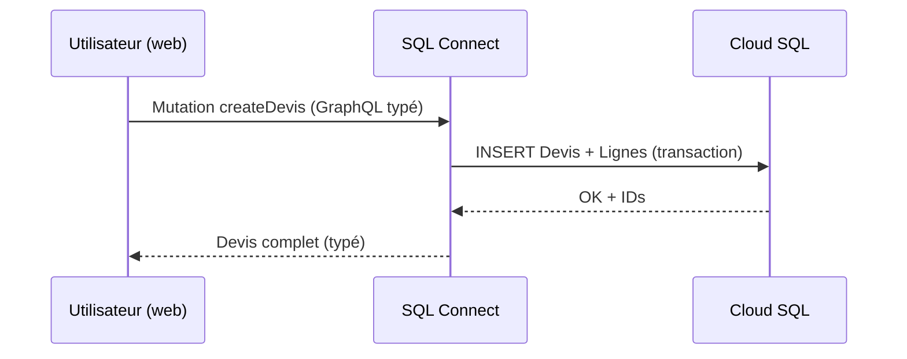
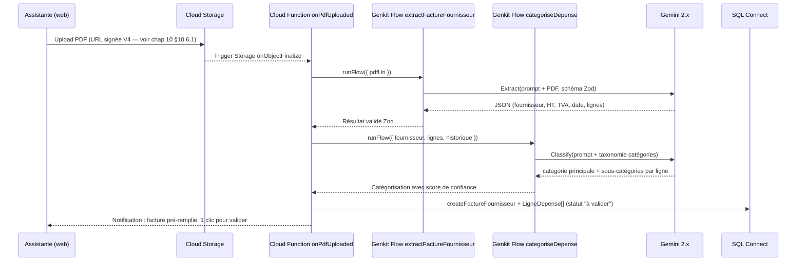
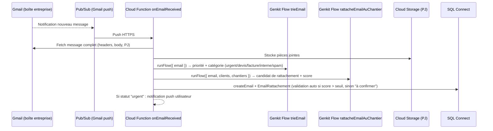
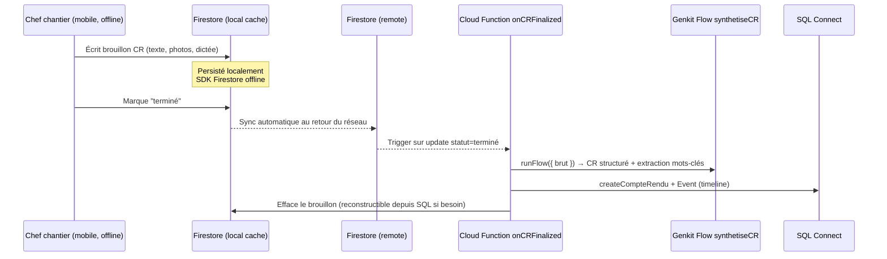
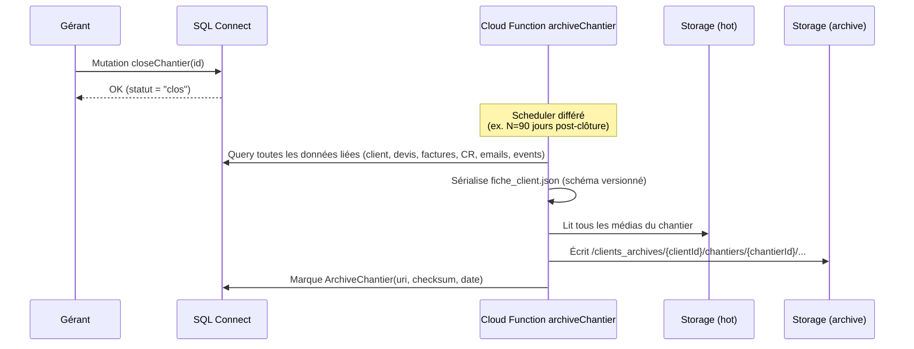

# Chapitre 02 — Architecture Globale

> **Statut** : stable (v0.2 — refondu mono-tenant / non fiscal)
> **Dernière révision** : 2026-04-22
> **Prérequis** : [01 — Vision](01-vision.md)
> **ADRs référencés** : [0001](adr/0001-platform-firebase.md), [0002](adr/0002-data-connect-relational.md), [0003](adr/0003-genkit-ai-layer.md), [0004](adr/0004-cold-storage-strategy.md), [0005](adr/0005-firestore-adjoint-only.md), [0006](adr/0006-internal-tool-scope.md), [0007](adr/0007-not-a-billing-tool.md), [0008](adr/0008-architecture-postgres-firestore-hybrid.md)

---

## 2.1 Principe architectural directeur

**Hexagonal léger** (ports & adapters) sur un socle Firebase / GCP.

La logique métier (catégorisation d'une dépense, règles de rattachement email ↔ chantier, calcul d'agrégats prévisionnels, politique d'archivage, validation d'un compte-rendu) est écrite en **TypeScript pur**, sans aucun import du SDK Firebase. Les adapters (SQL Connect, Firestore, Storage, Genkit, Auth, Gmail API) l'entourent.

**Pourquoi cette contrainte ?** Voir l'invariant §5.2 de [documentation.md](../documentation.md). Horizon 10-20 ans = on change inévitablement un ou plusieurs composants. La logique métier doit survivre aux migrations.

```
┌──────────────────────────────────────────────────────────────────┐
│                       FRONTEND (Web + Mobile)                     │
│   React/Next (web dashboards)  ·  Flutter/RN (mobile terrain)     │
└───────────────┬────────────────────────────┬─────────────────────┘
                │ SDK SQL Connect             │ SDK Firestore
                │ (analytics, fiches,         │ (offline-first,
                │  recherche, CRUD)           │  temps réel)
                ▼                             ▼
┌──────────────────────────────────────────────────────────────────┐
│                        EDGE / API LAYER                           │
│  SQL Connect · Cloud Functions v2 (TS) · Genkit · Gmail API       │
│                                                                   │
│   ┌────────────────────────────────────────────────────────────┐ │
│   │    DOMAIN CORE (TS pur, pas de dépendance infra)           │ │
│   │    — entités, invariants, cas d'usage, politiques          │ │
│   └────────────────────────────────────────────────────────────┘ │
└──┬────────────┬─────────────┬──────────────┬──────────────┬─────┘
   ▼            ▼             ▼              ▼              ▼
┌────────┐ ┌──────────┐ ┌────────────┐ ┌──────────┐ ┌────────────┐
│Cloud   │ │Firestore │ │Cloud       │ │Gemini    │ │Gmail /     │
│SQL     │ │(adjoint) │ │Storage     │ │via Genkit│ │Google      │
│Postgres│ │offline + │ │hot + cold  │ │extraction│ │Calendar    │
│(source │ │temps réel│ │buckets     │ │catégori- │ │APIs        │
│ vérité)│ │          │ │            │ │sation    │ │(ingestion) │
└────────┘ └──────────┘ └────────────┘ └──────────┘ └────────────┘
```

## 2.2 Stack technique (résumé exécutif)

| Couche | Technologie | Rôle | ADR |
|---|---|---|---|
| Auth & Identité | **Firebase Auth** classique (pas Identity Platform — mono-tenant) | Authentification, session, revendication de rôle | [0006](adr/0006-internal-tool-scope.md) |
| Persistance relationnelle (source de vérité) | **Firebase SQL Connect** sur Cloud SQL Postgres | Clients, chantiers, devis, factures, emails archivés, catégories, events, full-text | [0002](adr/0002-data-connect-relational.md), [0008](adr/0008-architecture-postgres-firestore-hybrid.md) |
| Base NoSQL adjointe | **Firestore** (en mode Native) | Offline-first mobile (CR brouillons, photos queue), temps réel collaboratif (planning), présence, notifications live | [0005](adr/0005-firestore-adjoint-only.md), [0008](adr/0008-architecture-postgres-firestore-hybrid.md) |
| API / Query layer | **GraphQL généré par SQL Connect** + SDK TS | Accès typé depuis le frontend web | [0002](adr/0002-data-connect-relational.md) |
| Logique serveur | **Cloud Functions v2** (Node 20+, TS) | Orchestrations, jobs, triggers (upload, email, scheduler) | — |
| IA / Orchestration | **Firebase Genkit** + Gemini 2.x | Extraction factures, catégorisation coûts, tri emails, synthèse CR, rattachement auto | [0003](adr/0003-genkit-ai-layer.md) |
| Stockage fichiers (hot) | **Cloud Storage** — Standard class | Photos, PDFs, pièces jointes emails, `.xlsx` ingérés | — |
| Stockage fichiers (cold) | **Cloud Storage** — Archive class | Archives long terme, snapshots JSON hebdo de la base | [0004](adr/0004-cold-storage-strategy.md) |
| Ingestion email | **Gmail API** + Pub/Sub push | Ingestion emails de la boîte entreprise vers Cloud Function → IA de tri → SQL Connect | — (chap. 06 à écrire) |
| Intégration calendrier | **Google Calendar API** (bidirectionnelle) | Sync planning Sosson ↔ agenda équipe | — (chap. 06 à écrire) |
| Observabilité | Cloud Logging, Cloud Trace, Genkit traces | Supervision, debug, FinOps | — (chap. 08) |
| Frontend web | À décider — probablement Next.js + shadcn/ui | Dashboards, fiches, recherche, saisie | — (chap. 07) |
| Frontend mobile | À décider — Flutter ou React Native | Chef de chantier terrain (offline-first) | — (chap. 07) |

## 2.3 Bounded contexts (contextes métier délimités)

Le domaine se découpe en contextes autonomes. Chaque contexte a son propre langage (glossaire), ses propres invariants, et — côté code — son propre dossier.

| Contexte | Entités principales | Responsabilité |
|---|---|---|
| **Accès & Rôles** | User, Role | Authentification, permissions internes (5 rôles : `OWNER`, `ADMIN`, `OPERATOR`, `MOBILE`, `VIEWER`) |
| **Relation Client** | Client, Contact | Fiche client unifiée, historique complet |
| **Production** | Chantier, Photo, CompteRendu | Exécution du travail, traçabilité terrain, mobile offline |
| **Commerce** | Devis, DevisLigne | Chiffrage opérationnel et envoi au client (pas fiscal) |
| **Documents Financiers Importés** | FactureFournisseur, FactureCliente | Ingestion, extraction IA, catégorisation. **Source légale reste ailleurs** (PDF original + logiciel comptable). |
| **Catégorisation & Analytics** | Categorie, LigneDepense, SnapshotAgregat | Taxonomie des postes de dépense (bois, quincaillerie...), agrégations pré-calculées pour dashboards |
| **Ingestion Email** | Email, EmailRattachement, RegleTri | Aspiration Gmail, tri IA, rattachement automatique email ↔ client/chantier |
| **Planning & Équipe** | Creneau, Assignation, Equipe | Vue calendrier collaborative, sync Google Calendar |
| **Ingestion Documents Divers** | DocumentAttache, ExcelImporte | Upload Excel, PDFs divers, OCR, extraction structurée |
| **Traçabilité** | Event, AuditLog | Timeline d'activité (unifie tout ce qui se passe sur un client / chantier), journal d'audit |
| **Archive** | ArchiveChantier | Passage en cold storage, intégrité long terme (pratique interne, pas obligation légale) |
| **Recherche globale** | — (index transverse) | Cmd-K global via Postgres `tsvector` sur Client / Chantier / Devis / FactureFournisseur / Email / CompteRendu |

Ces contextes apparaissent physiquement dans :
- Le **schéma SQL Connect** (groupes de types GraphQL) → voir [03 — Données](03-data-architecture.md).
- L'organisation du code (à venir en chapitre 07/08).
- Les **flows Genkit** nommés par contexte cible (ex : `extractFactureFournisseur`, `categoriseDepense`, `trieEmail`, `rattacheEmailAuChantier`, `synthetiseCR`) → voir [04 — Intelligence](04-intelligence.md).
- Les **Cloud Functions** de trigger (ex : `onPdfUploaded`, `onEmailReceived`, `onChantierClosed`).

## 2.4 Flux de référence

### 2.4.1 Flux "création d'un devis" (nominal, CRUD simple)



Pas de Cloud Function dans ce flux : c'est du **CRUD transactionnel pur**, SQL Connect suffit. Calcul de TVA par ligne et total = fonction pure TS appelée depuis un résolveur. Numérotation du devis = séquence Postgres (pour lisibilité, pas contrainte fiscale — voir [ADR 0007](adr/0007-not-a-billing-tool.md)). Détail : chapitre 03.

### 2.4.2 Flux "extraction + catégorisation facture fournisseur" (IA, cœur de l'outil)



Étape **nouvelle et centrale** vs v0.1 : le flow `categoriseDepense` qui range la dépense dans la taxonomie maison (bois, quincaillerie, sous-traitance, location matériel...). C'est ce qui alimente les dashboards prévisionnels. Détail : voir [04 — Intelligence](04-intelligence.md).

### 2.4.3 Flux "ingestion email entrant" (nouveau)



Les emails à rattachement incertain apparaissent dans une file "à trier" visible par l'assistante, qui valide d'un clic. Les retours alimentent un petit dataset d'affinage (voir chapitre 04).

### 2.4.4 Flux "compte-rendu mobile offline"



Pattern typique de l'ADR 0008 : **Firestore = zone d'atterrissage éphémère** pendant que le device est offline ; **SQL Connect = persistance définitive** une fois la donnée stabilisée.

### 2.4.5 Flux "clôture et archivage d'un chantier"



Même principe qu'en v0.1, mais **sans contrainte légale** — c'est une pratique d'archivage opérationnel interne (voir [ADR 0007](adr/0007-not-a-billing-tool.md)). Détail : voir [05 — Archivage](05-archival-strategy.md).

## 2.5 Environnements

| Environnement | Projet GCP | Usage | Data |
|---|---|---|---|
| **local** | Firebase Emulators Suite | Dev quotidien, tests | Fixtures |
| **dev** | `sosson-dev` | Intégration continue, démos internes | Jeux de test |
| **staging** | `sosson-staging` | Recette avant mise en prod, tests de charge | Clones anonymisés |
| **prod** | `sosson-prod` | Production | Réelles |

**Règle d'or** : aucune donnée prod en environnement inférieur. Pour reproduire un bug avec données réelles → anonymisation préalable (pipeline à décrire chapitre 08).

## 2.6 Frontières explicites

Ce que chaque composant fait **et ne fait pas**.

### SQL Connect fait
- CRUD transactionnel sur entités métier.
- Requêtes relationnelles typées, agrégations pour dashboards.
- Recherche full-text native (`tsvector` + `GIN`) sur tout le corpus textuel.
- Contrôles d'autorisation déclaratifs (règles par opération + claims Firebase Auth).

### SQL Connect **ne fait pas**
- Logique métier complexe multi-étapes → Cloud Function.
- Orchestration d'IA → Genkit flow.
- Génération de fichiers → Cloud Function.
- Envoi d'emails / appels externes (Gmail, Calendar) → Cloud Function.
- État temps réel collaboratif → Firestore adjoint.

### Firestore fait
- Cache offline-first mobile (CR brouillons, file de photos en attente d'upload).
- État collaboratif temps réel (édition concurrente de planning, présence).
- Notifications push éphémères (feed d'activité court terme).

### Firestore **ne fait pas**
- Hébergement de donnée durable, analytique ou recherchable → SQL Connect.
- Source de vérité pour quoi que ce soit (voir [ADR 0005](adr/0005-firestore-adjoint-only.md)).

### Cloud Functions font
- Orchestration de workflows : archivage, ingestion email, catégorisation, synthèse CR.
- Triggers d'événements (Storage upload, Pub/Sub Gmail, Firestore mutation "CR finalisé", scheduler).
- Appels vers services externes (Gmail API, Google Calendar API).
- Pont **Firestore → SQL Connect** (quand une donnée éphémère doit devenir durable).

### Cloud Functions **ne font pas**
- CRUD simple (inutile, SQL Connect s'en charge depuis le frontend).
- Héberger de la logique IA non-triviale → Genkit flow **appelé** depuis la fonction.

### Genkit fait
- Définition et exécution de flows IA **déterministes et tracés**.
- Validation d'entrée/sortie par schémas Zod.
- Observabilité native (traces, coûts).

### Genkit **ne fait pas**
- Persistance des résultats → retourne au caller (Function ou backend), qui écrit via SQL Connect.
- Auth utilisateur → déléguée à Firebase Auth en amont.

## 2.7 Coexistence SQL Connect + Firestore (règles d'or)

Firebase offre **trois bases** : SQL Connect (relationnel, via Cloud SQL Postgres), Firestore (NoSQL documents temps réel), Realtime Database (NoSQL arbre JSON, ancien). Sosson utilise :

| Base | Rôle | Statut |
|---|---|---|
| **SQL Connect** | **Source de vérité** métier (clients, chantiers, devis, factures) | Obligatoire |
| **Firestore** | **Adjoint temps réel optionnel** (présence, notifications live, feeds éphémères) | Optionnel, additif, jamais critique |
| **Realtime Database** | — | **Interdit** (obsolète, pas de cas d'usage justifié) |

### Règles d'or (voir [ADR 0005](adr/0005-firestore-adjoint-only.md) et [ADR 0008](adr/0008-architecture-postgres-firestore-hybrid.md))

**Règle simple de choix** : *"Est-ce que cette donnée doit être filtrée, triée, agrégée, cherchée ou conservée plus que quelques jours ?"*
- **Oui** → SQL Connect.
- **Non, elle est juste "maintenant" ou collaborative** → Firestore.
- **En cas de doute → SQL Connect par défaut.**

**Règles strictes** :
1. **Toute donnée qui alimente un dashboard, une recherche, une fiche client/chantier** → SQL Connect. Toujours.
2. **Toute donnée durable au-delà de 72 h** → SQL Connect.
3. **Firestore est reconstructible depuis SQL Connect** (ou depuis une reconnexion utilisateur). Si Firestore disparaît demain, aucune perte critique.
4. **Pas de transaction cross-base.** SQL Connect ↔ Firestore ne partagent pas de transaction atomique. Une donnée vit **soit** en SQL, **soit** en Firestore, jamais écartelée.
5. **Tout usage de Firestore pérenne fait l'objet d'un addendum à l'[ADR 0005](adr/0005-firestore-adjoint-only.md)** indiquant le quoi, le pourquoi, le TTL, le plan de reconstruction.

### Exemples concrets

| Cas d'usage | Où ça vit | Pourquoi |
|---|---|---|
| Client, Chantier, Devis, FactureFournisseur, Email archivé, Categorie, Event | SQL Connect | Source de vérité, recherche, analytics |
| LigneDepense catégorisée (alimente dashboards) | SQL Connect | Agrégations par catégorie, période |
| Photo / PDF / Excel (métadonnées) | SQL Connect | Liés à un chantier, indexés, cherchables |
| Photo / PDF / Excel (binaire) | Cloud Storage | Fichier, pas donnée structurée |
| CR mobile **brouillon** (en cours de rédaction, offline) | Firestore | Doit persister sur le device sans réseau |
| CR **finalisé** | SQL Connect | Durable, cherchable, visible dans timeline |
| Planning collaboratif en cours d'édition | Firestore | Édition simultanée, temps réel |
| Planning validé (créneaux confirmés) | SQL Connect | Durable, requêtable "qui fait quoi la semaine prochaine" |
| "3 utilisateurs connectés sur cette fiche" | Firestore | Éphémère, pur UX |
| File "photos en attente d'upload depuis le téléphone" | Firestore | Queue locale, reconstructible (ré-upload manuel si perte) |
| Notification push "nouvelle facture à valider" | Firestore + FCM | Éphémère, déclencheur UX |
| Archive `fiche_client.json` | Cloud Storage Archive | Froid, immuable |

## 2.8 Stratégie de portabilité (horizon 10-20 ans)

Comment on se prépare à **changer** un de ces composants sans tout refaire.

| Composant Firebase | Stratégie de découplage | Coût de remplacement |
|---|---|---|
| SQL Connect | Repository interfaces dans le domain core. Schéma GraphQL = contrat, Postgres sous-jacent = standard. | **Faible à moyen** — Postgres reste Postgres. On refait la couche GraphQL. |
| Firestore | Interface `EphemeralState` pour offline mobile et temps réel. Données reconstructibles depuis SQL Connect. | **Faible** — si on migre, on perd juste UX temps réel le temps de réécrire cette couche. Aucune donnée durable en jeu. |
| Firebase Auth | Interface `AuthProvider` dans le domain. Claims mappés vers un objet domaine `Identity`. | Moyen — toute plateforme auth moderne (Auth0, Clerk, Keycloak) expose les mêmes primitives. |
| Genkit | Interface `IntelligenceService` par cas d'usage. Les prompts sont versionnés dans le repo, pas dans Genkit. | **Faible** — Genkit est une lib Node. Les prompts et schémas restent valides sur n'importe quel provider. |
| Cloud Storage | Interface `BlobStore` (put, get, list, lifecycle). | **Faible** — S3, Azure Blob, etc. ont la même API. |
| Cloud Functions | Code en TS standard. Si on migre, on déploie ailleurs (Cloud Run, Workers). | Faible. |
| Gmail API / Google Calendar API | Interfaces `EmailProvider` et `CalendarProvider`. Si migration IMAP / CalDAV nécessaire un jour, seule l'implémentation de l'adapter change. | **Moyen** — Gmail et Calendar ont des modèles spécifiques, mais l'abstraction métier (email = headers + body + PJ + status) reste stable. |

**Principe** : aucun code métier n'importe `firebase-admin`, `@genkit-ai/core`, `googleapis/gmail` ou équivalent. Ces imports vivent dans des fichiers `adapters/*.ts` clairement identifiés.

## 2.9 Ce que ce chapitre **ne couvre pas**

- Détail des entités et du schéma GraphQL → [03 — Architecture des Données](03-data-architecture.md).
- Détail des prompts et flows Genkit → [04 — Couche Intelligence](04-intelligence.md).
- Détail de la sérialisation d'archive → [05 — Archivage](05-archival-strategy.md).
- Spécification détaillée des intégrations Gmail / Google Calendar → [chapitre 06](06-integrations.md).
- Sécurité, rôles, permissions internes → [chapitre 10](10-securite.md).
- Choix frontend précis (Next.js / Flutter / React Native) → chapitre 07.
- Coûts réels par composant au volume Sosson → chapitre 09.

---

**Chapitre suivant** : [03 — Architecture des Données](03-data-architecture.md).
