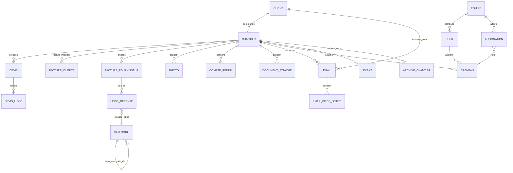

# Chapitre 03 — Architecture des Données

> **Statut** : stable v0.2 (schéma refondu mono-tenant, non fiscal ; à valider par prototypage)
> **Dernière révision** : 2026-04-22
> **Prérequis** : [02 — Architecture](02-architecture.md)
> **ADRs référencés** : [0002](adr/0002-data-connect-relational.md) *(Superseded by 0009)*, [0004](adr/0004-cold-storage-strategy.md), [0006](adr/0006-internal-tool-scope.md), [0007](adr/0007-not-a-billing-tool.md), [0008](adr/0008-architecture-postgres-firestore-hybrid.md), [0009](adr/0009-sql-connect-repivot-justification.md)

---

## 3.1 Objectifs de la couche données

1. **Intégrité relationnelle** entre les entités métier (un Devis appartient à un Chantier qui appartient à un Client).
2. **Mono-tenant assumé** : pas de discriminant `entrepriseId`, pas d'entité `Entreprise`. Voir [ADR 0006](adr/0006-internal-tool-scope.md).
3. **Traçabilité opérationnelle** : timeline des events, audit log, historique des modifications. *Non fiscal* (voir [ADR 0007](adr/0007-not-a-billing-tool.md)).
4. **Analytics natif** : schéma pensé pour nourrir les dashboards (agrégations par catégorie, par période, par chantier) sans pipeline externe.
5. **Recherche full-text** sur tout le corpus textuel (clients, chantiers, emails, CR, descriptions de facture).
6. **Cycle de vie hot / warm / cold** : l'actif reste en base, le clôturé ancien descend en archive.
7. **Typage fort de bout en bout** : du schéma GraphQL au composant React.

## 3.2 Cycle de vie des données

```
┌──────────┐  chantier actif    ┌──────────┐  clôture +    ┌──────────────┐
│   HOT    │───────────────────▶│   WARM   │  délai X mois │     COLD     │
│ Postgres │                    │ Postgres │──────────────▶│  GCS Archive │
│ Standard │                    │ (lecture │               │ fiche.json + │
│ bucket   │                    │ seule    │               │ médias       │
│ médias   │                    │ logique) │               │              │
└──────────┘                    └──────────┘               └──────────────┘
```

| État | Support | Latence accès | Coût relatif | Qui peut écrire |
|---|---|---|---|---|
| HOT | Cloud SQL + Storage Standard | < 100 ms | **1×** (référence) | Utilisateurs autorisés |
| WARM | Cloud SQL (chantier clos, statut verrouillé) + Storage Standard | < 100 ms | ~1× | Personne (lecture seule) |
| COLD | Cloud Storage Archive (JSON + médias) | seconde à minute (restauration) | **~0,01×** stockage, mais coût de lecture élevé | Personne (immuable) |

**Règle de passage HOT → WARM** : `Chantier.statut = 'clos'` et `dateCloture` positionnée. La donnée reste en base, lisible par tous mais éditable uniquement par un utilisateur avec le rôle `ADMIN` ou supérieur (verrouillage logique, pas physique — voir [ADR 0007](adr/0007-not-a-billing-tool.md) : on n'interdit pas les modifications, on les trace).

**Règle de passage WARM → COLD** : déclenchée par un job scheduler (ex. N=90 jours post-clôture — politique acter dans [05 — Archivage](05-archival-strategy.md)). Produit une archive JSON immuable dans GCS Archive class, puis **peut** purger la base et le bucket hot après validation d'intégrité (checksum).

## 3.3 Modèle de domaine — vue logique

### 3.3.1 Diagramme entités-relations



Le diagramme montre les relations principales. **Note** : `EVENT` et `AUDIT_LOG` (transverses) ne sont pas montrés pour éviter la surcharge ; ils pointent vers n'importe quelle entité via `entityType` + `entityId`.

### 3.3.2 Entités — vue canonique

Pour chaque entité : sa responsabilité, ses invariants, ses champs essentiels. **La liste exhaustive des champs vit dans le schéma GraphQL** (§3.4). Ici on documente **le sens**, pas la syntaxe.

#### User
- Utilisateur humain interne à Sosson.
- Invariants : `firebaseUid` unique, mappé 1-1 avec Firebase Auth.
- Rôles : `OWNER`, `ADMIN`, `OPERATOR`, `MOBILE` (chef de chantier, accès mobile restreint), `VIEWER`. Voir [chapitre 10 — Sécurité §10.4](10-securite.md).

#### Client
- Client final de l'entreprise.
- Un Client peut avoir plusieurs Chantiers.
- Types : `PARTICULIER`, `PROFESSIONNEL`.

#### Chantier
- **Entité pivot** du domaine. Unité d'agrégation de tout ce qui concerne un travail.
- Invariants :
  - Un Chantier appartient à exactement **un Client**.
  - Statuts : `PROSPECT`, `EN_COURS`, `SUSPENDU`, `CLOS`, `ARCHIVE`.
  - Transition `CLOS → ARCHIVE` implique création d'une `ArchiveChantier` + déplacement en cold storage.
- Champs essentiels : nom, référence interne, adresse, dates prévisionnelles/réelles, statut, chef de chantier assigné, budget prévisionnel (pour comparaison dashboard).

#### Devis
- Proposition chiffrée pour un Chantier. **Opérationnel, pas fiscal** (voir [ADR 0007](adr/0007-not-a-billing-tool.md)).
- Statuts : `BROUILLON`, `ENVOYE`, `ACCEPTE`, `REFUSE`, `EXPIRE`.
- Les modifications après envoi sont **tracées** (audit log), pas interdites.
- `DevisLigne` : désignation, quantité, prix unitaire HT, taux TVA. Les lignes sont exploitables pour générer un budget prévisionnel du Chantier.
- Numérotation : séquence Postgres pour lisibilité (ex. `DEV-2026-0042`), **sans contrainte de continuité fiscale**.

#### FactureCliente
- **Import** de la facture émise ailleurs (logiciel du comptable) pour traçabilité opérationnelle.
- Pas de génération depuis Sosson. Champs : numéro (tel qu'émis par le comptable), date, montants, lien PDF externe ou upload.
- Sert à alimenter le dashboard "qu'a-t-on facturé sur ce chantier / ce mois".

#### FactureFournisseur
- Document de facturation reçu d'un tiers (matériel, sous-traitant, location).
- **Cible #1 de l'extraction IA + catégorisation.** Voir [04 — Intelligence](04-intelligence.md).
- Champs : fournisseurNom, fournisseurSiret, numeroFournisseur, dateEmission, dateEcheance, montantHT, montantTTC, tvaDetailJson, pdfStorageUri, statutExtraction (`BRUT` / `EXTRAIT_IA` / `VALIDE_HUMAIN` / `REJETE`), scoreConfianceIA.
- Rattachement : optionnel à la réception, un flow IA propose un Chantier candidat.
- Déclinée en **LigneDepense** pour la granularité catégorielle.

#### LigneDepense
- Une ligne de détail d'une FactureFournisseur, catégorisée.
- Exemple : une facture Leroy Merlin de 1 200 € peut éclater en `bois : 800 €`, `quincaillerie : 300 €`, `divers : 100 €`.
- Champs : designation, quantite, montantHT, montantTTC, categorieId, scoreConfianceCategorisation.
- **Créée par le flow IA `categoriseDepense`** puis validable humainement.

#### Categorie
- Taxonomie maison des postes de dépense.
- Hiérarchique (arbre) : ex. `Matériaux > Bois > Chevron`, `Prestations > Sous-traitance > Maçonnerie`.
- **Enrichie dans le temps** par l'équipe : ajout / renommage / fusion de catégories sans migration lourde.

#### Photo, CompteRendu, DocumentAttache
- Médias et notes rattachés à un Chantier.
- **Photo** : pointeur Storage + métadonnées (prise le, auteur, géoloc optionnelle, légende).
- **CompteRendu** : texte Markdown, auteur, date, photos liées, extraction IA de mots-clés (pour recherche).
- **DocumentAttache** : tout autre fichier (Excel, PDF divers, plan) + métadonnées (type détecté, résumé IA optionnel).

#### Email
- Email ingéré depuis la boîte entreprise (Gmail API).
- Champs : gmailId (déduplication), from, to, cc, subject, bodyText, bodyHtml, receivedAt, priorite (`URGENT` / `NORMAL` / `FAIBLE` / `SPAM`), categorie (`CLIENT_DEMANDE` / `CLIENT_REPONSE` / `DEVIS` / `FACTURE` / `FOURNISSEUR` / `INTERNE` / `AUTRE`), statutRattachement (`NON_TRAITE` / `AUTO_RATTACHE` / `HUMAIN_CONFIRME` / `A_CONFIRMER` / `SANS_RATTACHEMENT`).
- Rattachable à 0–1 Client et 0–1 Chantier (via `EmailRattachement`).
- Pièces jointes : `EmailPieceJointe` avec lien Storage.

#### EmailRattachement
- Table d'association many-to-many Email ↔ entité (Client ou Chantier).
- Champs : emailId, entityType (`CLIENT`/`CHANTIER`), entityId, scoreConfianceIA, rattachePar (user id, null si IA), confirmeLe.

#### Creneau, Assignation, Equipe
- Gestion du planning.
- **Creneau** : un bloc temporel sur un Chantier (ex. `2026-05-15 08:00 → 17:00`, type `TRAVAUX` ou `RDV_CLIENT`).
- **Equipe** : groupe récurrent de Users (ex. équipe charpente).
- **Assignation** : affectation d'une Equipe (ou d'un User directement) à un Creneau.
- Synchronisable avec Google Calendar (voir chap. 06).

#### Event
- **Entité transverse** : trace de tout ce qui se passe (facture validée, email urgent reçu, CR publié, chantier clôturé, devis accepté...).
- Champs : type, entityType, entityId, userId (auteur), payloadJson (détails), createdAt.
- Alimente la **timeline unifiée** de la fiche client / chantier et les **feeds d'activité**.
- Ne remplace pas `AuditLog` (qui trace les modifications sensibles pour audit) mais peut s'en nourrir.

#### AuditLog
- Trace de toute modification sensible (suppression, ré-assignation, édition après envoi, etc.).
- Champs : entityType, entityId, operation (`CREATE`/`UPDATE`/`DELETE`), avant, apres, userId, timestamp.
- **Ne se supprime jamais.**

#### ArchiveChantier
- Marqueur relationnel d'un Chantier **déplacé en cold storage**.
- Champs : chantierId d'origine, clientId, uriArchiveJson (GCS), uriArchiveRacine, checksumJson (SHA-256), dateArchivage, versionSchemaArchive.
- **Reste en base éternellement** pour retrouver l'archive par recherche client.

## 3.4 Schéma Firebase SQL Connect — proposition v0.2

> Ce schéma est **une proposition de travail** refondue après ADRs 0006 / 0007 / 0008. Il sera validé par prototypage avant figeage.

Fichier cible : `dataconnect/schema/schema.gql`.

### 3.4.1 Conventions de nommage

- Types GraphQL : **PascalCase**, singulier (`Client`, pas `Clients`).
- Champs : **camelCase**.
- Enums : **SCREAMING_SNAKE_CASE** pour les valeurs.
- Timestamps : toujours `createdAt` / `updatedAt` / (selon cas) `deletedAt`, type `Timestamp`.
- Clés étrangères : type de relation, pas `fooId` + type séparé. Ex : `client: Client!`.
- **Pas de discriminant tenant** : mono-tenant assumé ([ADR 0006](adr/0006-internal-tool-scope.md)).
- **Pas d'immuabilité stricte** au niveau base : modifications tracées via `AuditLog` ([ADR 0007](adr/0007-not-a-billing-tool.md)).

### 3.4.2 Schéma (v0.2)

```graphql
# ==========================================================================
# Identité & Rôles
# ==========================================================================

type User @table {
  id: UUID! @default(expr: "uuid_generate_v4()")
  firebaseUid: String! @col(dataType: "varchar(128)")  # unique indexé
  email: String!
  nom: String!
  role: UserRole!
  actif: Boolean! @default(expr: "true")
  createdAt: Timestamp! @default(expr: "now()")
  updatedAt: Timestamp! @default(expr: "now()")
}

enum UserRole { OWNER ADMIN OPERATOR MOBILE VIEWER }

# ==========================================================================
# Relation Client
# ==========================================================================

type Client @table {
  id: UUID! @default(expr: "uuid_generate_v4()")
  nom: String!
  typeClient: TypeClient!       # PARTICULIER | PROFESSIONNEL
  siret: String
  email: String
  telephone: String
  adresse: String
  notesInternes: String         # champ texte libre indexé tsvector
  createdAt: Timestamp! @default(expr: "now()")
  updatedAt: Timestamp! @default(expr: "now()")
  deletedAt: Timestamp          # soft delete
}

enum TypeClient { PARTICULIER PROFESSIONNEL }

# ==========================================================================
# Production : Chantier & médias
# ==========================================================================

type Chantier @table {
  id: UUID! @default(expr: "uuid_generate_v4()")
  client: Client!
  reference: String!            # ex "2026-042", lisible
  nom: String!
  description: String           # indexé tsvector
  adresse: String
  statut: StatutChantier!
  chefChantier: User
  budgetPrevisionnelHT: Decimal # pour comparaison avec dépenses cumulées
  dateDebutPrevue: Date
  dateFinPrevue: Date
  dateDebutReelle: Date
  dateCloture: Timestamp
  createdAt: Timestamp! @default(expr: "now()")
  updatedAt: Timestamp! @default(expr: "now()")
}

enum StatutChantier { PROSPECT EN_COURS SUSPENDU CLOS ARCHIVE }

type Photo @table {
  id: UUID! @default(expr: "uuid_generate_v4()")
  chantier: Chantier!
  storageUri: String!           # gs://bucket/path
  prisePar: User
  priseLe: Timestamp
  legende: String
  latitude: Float
  longitude: Float
  createdAt: Timestamp! @default(expr: "now()")
}

type CompteRendu @table {
  id: UUID! @default(expr: "uuid_generate_v4()")
  chantier: Chantier!
  auteur: User!
  contenuMarkdown: String!      # indexé tsvector
  motsClesIA: String            # JSON array, extrait par flow synthetiseCR
  createdAt: Timestamp! @default(expr: "now()")
  updatedAt: Timestamp! @default(expr: "now()")
}

type DocumentAttache @table {
  id: UUID! @default(expr: "uuid_generate_v4()")
  chantier: Chantier
  client: Client                # soit l'un soit l'autre (ou les deux)
  storageUri: String!
  nomFichier: String!
  typeDetecte: TypeDocument!    # PDF | EXCEL | IMAGE | PLAN | AUTRE
  tailleBytes: Int!
  resumeIA: String              # si extraction pertinente
  ajoutePar: User!
  createdAt: Timestamp! @default(expr: "now()")
}

enum TypeDocument { PDF EXCEL IMAGE PLAN AUTRE }

# ==========================================================================
# Commerce : Devis (opérationnel, non fiscal)
# ==========================================================================

type Devis @table {
  id: UUID! @default(expr: "uuid_generate_v4()")
  chantier: Chantier!
  numero: String!               # lisible, pas de contrainte fiscale
  statut: StatutDevis!
  dateEmission: Date!
  dateValidite: Date
  montantHT: Decimal!
  montantTTC: Decimal!
  conditions: String
  pdfStorageUri: String         # généré à l'envoi
  createdAt: Timestamp! @default(expr: "now()")
  updatedAt: Timestamp! @default(expr: "now()")
}

enum StatutDevis { BROUILLON ENVOYE ACCEPTE REFUSE EXPIRE }

type DevisLigne @table {
  id: UUID! @default(expr: "uuid_generate_v4()")
  devis: Devis!
  ordre: Int!
  designation: String!
  quantite: Decimal!
  prixUnitaireHT: Decimal!
  tauxTVA: Decimal!             # 0.20, 0.10, 0.055, 0
}

# ==========================================================================
# Documents financiers importés
# ==========================================================================

# Facture cliente = IMPORT d'une facture émise ailleurs (logiciel comptable)
type FactureCliente @table {
  id: UUID! @default(expr: "uuid_generate_v4()")
  chantier: Chantier!
  numeroExterne: String!        # numéro tel qu'émis par le comptable
  dateEmission: Date!
  dateEcheance: Date
  montantHT: Decimal!
  montantTTC: Decimal!
  statutEncaissement: StatutEncaissement!
  pdfStorageUri: String         # PDF original tel que reçu
  sourceImport: SourceImport!   # MANUEL | EMAIL | API_COMPTABLE
  createdAt: Timestamp! @default(expr: "now()")
  updatedAt: Timestamp! @default(expr: "now()")
}

enum StatutEncaissement { EN_ATTENTE PARTIEL PAYE EN_RETARD }
enum SourceImport { MANUEL EMAIL API_COMPTABLE }

# Facture fournisseur = REÇUE par l'entreprise, cible extraction + catégorisation IA
type FactureFournisseur @table {
  id: UUID! @default(expr: "uuid_generate_v4()")
  chantier: Chantier            # rattachement optionnel, rempli par IA ou humain
  fournisseurNom: String!
  fournisseurSiret: String
  numeroFournisseur: String
  dateEmission: Date
  dateEcheance: Date
  montantHT: Decimal
  montantTTC: Decimal
  tvaDetailJson: String         # JSON { "0.20": 12.34, "0.10": 5.67 }
  devise: String! @default(expr: "'EUR'")
  pdfStorageUri: String!
  statutExtraction: StatutExtraction!
  scoreConfianceIA: Float
  validePar: User
  valideLe: Timestamp
  createdAt: Timestamp! @default(expr: "now()")
  updatedAt: Timestamp! @default(expr: "now()")
}

enum StatutExtraction { BRUT EXTRAIT_IA VALIDE_HUMAIN REJETE }

# ==========================================================================
# Catégorisation & Analytics
# ==========================================================================

type Categorie @table {
  id: UUID! @default(expr: "uuid_generate_v4()")
  nom: String!                  # ex. "Bois", "Chevron", "Quincaillerie"
  parent: Categorie             # hiérarchie arbre
  couleur: String               # hex pour affichage dashboard
  actif: Boolean! @default(expr: "true")
  createdAt: Timestamp! @default(expr: "now()")
  updatedAt: Timestamp! @default(expr: "now()")
}

type LigneDepense @table {
  id: UUID! @default(expr: "uuid_generate_v4()")
  factureFournisseur: FactureFournisseur!
  categorie: Categorie
  ordre: Int!
  designation: String!
  quantite: Decimal
  montantHT: Decimal!
  montantTTC: Decimal!
  scoreConfianceCategorisation: Float
  categorieValideeParHumain: Boolean! @default(expr: "false")
  createdAt: Timestamp! @default(expr: "now()")
}

# ==========================================================================
# Ingestion email
# ==========================================================================

type Email @table {
  id: UUID! @default(expr: "uuid_generate_v4()")
  gmailId: String!              # unique, déduplication
  threadId: String              # conversation Gmail
  fromAdresse: String!
  fromNom: String
  toAdresses: String!           # JSON array
  ccAdresses: String            # JSON array
  sujet: String!                # indexé tsvector
  bodyText: String              # indexé tsvector
  bodyHtmlUri: String           # si conservé, pointeur Storage
  receivedAt: Timestamp!
  priorite: PrioriteEmail!
  categorie: CategorieEmail!
  statutRattachement: StatutRattachement!
  scoreConfianceTri: Float
  lu: Boolean! @default(expr: "false")
  archive: Boolean! @default(expr: "false")
  createdAt: Timestamp! @default(expr: "now()")
  updatedAt: Timestamp! @default(expr: "now()")
}

enum PrioriteEmail { URGENT NORMAL FAIBLE SPAM }
enum CategorieEmail { CLIENT_DEMANDE CLIENT_REPONSE DEVIS FACTURE FOURNISSEUR INTERNE AUTRE }
enum StatutRattachement { NON_TRAITE AUTO_RATTACHE HUMAIN_CONFIRME A_CONFIRMER SANS_RATTACHEMENT }

type EmailRattachement @table {
  id: UUID! @default(expr: "uuid_generate_v4()")
  email: Email!
  chantier: Chantier            # un des deux au moins
  client: Client
  scoreConfianceIA: Float
  rattachePar: User             # null si IA automatique
  confirmeLe: Timestamp
  createdAt: Timestamp! @default(expr: "now()")
}

type EmailPieceJointe @table {
  id: UUID! @default(expr: "uuid_generate_v4()")
  email: Email!
  storageUri: String!
  nomFichier: String!
  typeMime: String
  tailleBytes: Int!
  documentAttache: DocumentAttache   # si la PJ a été élevée au rang de document rattaché
  createdAt: Timestamp! @default(expr: "now()")
}

# ==========================================================================
# Planning & Équipe
# ==========================================================================

type Equipe @table {
  id: UUID! @default(expr: "uuid_generate_v4()")
  nom: String!                  # ex. "Équipe charpente"
  couleur: String
  actif: Boolean! @default(expr: "true")
  createdAt: Timestamp! @default(expr: "now()")
}

type MembreEquipe @table(key: ["equipe", "user"]) {
  equipe: Equipe!
  user: User!
  role: String                  # ex. "chef", "compagnon"
  createdAt: Timestamp! @default(expr: "now()")
}

type Creneau @table {
  id: UUID! @default(expr: "uuid_generate_v4()")
  chantier: Chantier!
  debut: Timestamp!
  fin: Timestamp!
  type: TypeCreneau!            # TRAVAUX | RDV_CLIENT | LIVRAISON | AUTRE
  description: String
  googleCalendarEventId: String # pour sync bidirectionnelle
  createdAt: Timestamp! @default(expr: "now()")
  updatedAt: Timestamp! @default(expr: "now()")
}

enum TypeCreneau { TRAVAUX RDV_CLIENT LIVRAISON AUTRE }

type Assignation @table {
  id: UUID! @default(expr: "uuid_generate_v4()")
  creneau: Creneau!
  equipe: Equipe                # soit équipe, soit user direct
  user: User
  createdAt: Timestamp! @default(expr: "now()")
}

# ==========================================================================
# Traçabilité : Event & AuditLog
# ==========================================================================

# Event = trace fonctionnelle, pour la timeline et les feeds
type Event @table {
  id: UUID! @default(expr: "uuid_generate_v4()")
  type: String!                 # ex "DEVIS_ENVOYE", "FACTURE_VALIDEE", "EMAIL_URGENT_RECU"
  entityType: String!           # ex "Chantier", "Client", "Devis"
  entityId: UUID!
  chantier: Chantier            # pour requête rapide "timeline d'un chantier"
  client: Client                # pour "timeline d'un client"
  auteur: User                  # null si événement système
  payloadJson: String           # détails sérialisés
  createdAt: Timestamp! @default(expr: "now()")
}

# AuditLog = trace technique des modifications sensibles
type AuditLog @table {
  id: UUID! @default(expr: "uuid_generate_v4()")
  entityType: String!
  entityId: UUID!
  operation: OperationAudit!
  avantJson: String             # snapshot avant
  apresJson: String             # snapshot après
  user: User
  raison: String                # optionnelle
  createdAt: Timestamp! @default(expr: "now()")
}

enum OperationAudit { CREATE UPDATE DELETE RESTORE }

# ==========================================================================
# Archive
# ==========================================================================

type ArchiveChantier @table {
  id: UUID! @default(expr: "uuid_generate_v4()")
  clientId: UUID!               # id du client même si client supprimé ensuite
  chantierIdOrigine: UUID!
  uriArchiveJson: String!       # gs://bucket-archive/clients_archives/{clientId}/chantiers/{chantierId}/fiche_client.json
  uriArchiveRacine: String!
  checksumJson: String!         # SHA-256
  versionSchemaArchive: String! # ex "1.0.0"
  dateArchivage: Timestamp! @default(expr: "now()")
}
```

### 3.4.3 Notes de conception

- **UUID partout.** Pas de `Int auto-increment` (plus simple côté sync mobile et export).
- **Pas d'`Entreprise`.** Mono-tenant. Les contrôles d'isolation se font uniquement par rôle utilisateur.
- **Soft delete `deletedAt`** sur `Client` uniquement. Sur tout le reste : suppression possible **avec trace dans `AuditLog`** (voir [ADR 0007](adr/0007-not-a-billing-tool.md)).
- **Decimal partout** pour les montants. Jamais Float.
- **`tvaDetailJson` en texte** sur FactureFournisseur : structure variable selon le fournisseur, sérialisé et parsé côté application.
- **`LigneDepense` obligatoire** pour toute FactureFournisseur catégorisée. C'est ce qui nourrit les dashboards prévisionnels par catégorie — **sans elle, pas de value #1**.
- **`Event` vs `AuditLog`** : `Event` est fonctionnel (visible dans la timeline utilisateur), `AuditLog` est technique (visible uniquement par ADMIN/OWNER dans un écran de debug).
- **`Email.bodyHtmlUri`** : le HTML peut être volumineux. On le stocke sur GCS, pas en base, pour ne pas gonfler la DB.
- **`Creneau.googleCalendarEventId`** : clé de réconciliation pour la sync bidirectionnelle avec Google Calendar. Détail chap. 06.
- **Indexes full-text `tsvector`** sur : `Client.nom + notesInternes`, `Chantier.nom + description + reference`, `Devis.designation (via DevisLigne)`, `CompteRendu.contenuMarkdown`, `Email.sujet + bodyText`. Génèrent une recherche globale Cmd-K performante.

## 3.5 Règles de numérotation (non fiscale)

[ADR 0007](adr/0007-not-a-billing-tool.md) : Sosson n'a **pas** de contrainte de numérotation continue fiscale. La numérotation sert uniquement la **lisibilité humaine**.

- Devis : séquence Postgres + format `DEV-YYYY-NNNN` (ex. `DEV-2026-0042`). Des trous sont acceptables (brouillon supprimé → numéro perdu).
- FactureCliente : **importe le numéro externe** tel qu'émis par le logiciel du comptable. Aucune séquence Sosson.
- FactureFournisseur : utilise le `numeroFournisseur` tel qu'écrit sur la facture reçue (pas de numéro interne Sosson).
- Chantier : référence libre saisie par l'équipe (ex. `2026-DURAND-PARIS`), ou auto-générée en fallback (`CH-YYYY-NNNN`).

## 3.6 Stratégie d'indexation (intention)

Indexes nécessaires prévus (à matérialiser via `@index` SQL Connect ou SQL direct) :

| Table | Colonnes / Type | Pourquoi |
|---|---|---|
| User | `firebaseUid` (unique B-tree) | Lookup à chaque requête authentifiée |
| Client | `nom` B-tree + `tsvector(nom, notesInternes)` GIN | Recherche client + full-text |
| Chantier | `statut` B-tree, `client` B-tree, `tsvector(nom, description, reference)` GIN | Tableau de bord, fiche client, recherche globale |
| Devis | `chantier` B-tree, `statut` B-tree, `numero` unique | Listes, filtrage |
| FactureFournisseur | `chantier`, `statutExtraction`, `fournisseurNom` | Workflow validation, dashboard fournisseurs |
| LigneDepense | `categorie`, `factureFournisseur`, `createdAt` | Dashboards analytiques par catégorie / période |
| Categorie | `parent` | Descente arbre hiérarchique |
| Email | `gmailId` unique, `statutRattachement`, `priorite`, `receivedAt`, `tsvector(sujet, bodyText)` GIN | Déduplication, tri, full-text |
| EmailRattachement | `email`, `(chantier, client)` | Remonter "tous les emails liés à ce chantier" |
| Creneau | `(debut, fin)` B-tree, `chantier` | Vue calendrier par période |
| Event | `(entityType, entityId, createdAt DESC)`, `chantier`, `client` | Timeline par entité |
| AuditLog | `(entityType, entityId, createdAt DESC)`, `user` | Enquête sur une modification |
| ArchiveChantier | `clientId` B-tree | "Voir les archives de ce client" |

À affiner sous charge réelle — voir chapitre 08 (à écrire).

## 3.7 Gestion des migrations

- **SQL Connect** gère les migrations via son CLI (`firebase dataconnect:sql:migrate`).
- Chaque migration est un fichier SQL versionné dans `dataconnect/migrations/`.
- Règle : **aucune migration destructive** sans double étape (deploy 1 = écriture dans les deux formats ; deploy 2 = suppression de l'ancien). Pas de `DROP COLUMN` en un coup.
- Une migration qui casse la compatibilité du schéma d'archive oblige à un bump de `versionSchemaArchive` dans [05 — Archivage](05-archival-strategy.md).

## 3.8 Ce que ce chapitre **ne couvre pas**

- Le contenu exact du fichier `fiche_client.json` produit à l'archivage → [05 — Archivage](05-archival-strategy.md).
- Les règles d'autorisation SQL Connect (qui peut lire/écrire quoi selon le rôle) → [chapitre 10 — Sécurité](10-securite.md).
- Le schéma Firestore (collections adjointes : CR brouillons mobile, planning collaboratif, présence) → [chapitre 10 §10.5](10-securite.md) ou addendums à [ADR 0005](adr/0005-firestore-adjoint-only.md).
- Les définitions Gmail / Google Calendar côté intégration → [chapitre 06 — Intégrations](06-integrations.md).
- La stratégie de seed et de fixtures → chapitre 08 Opérations.

---

**Chapitre suivant** : [04 — Couche Intelligence](04-intelligence.md).
