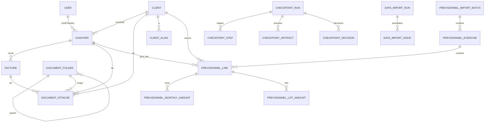
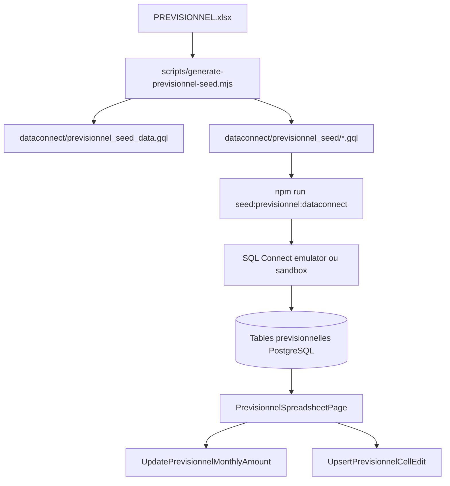
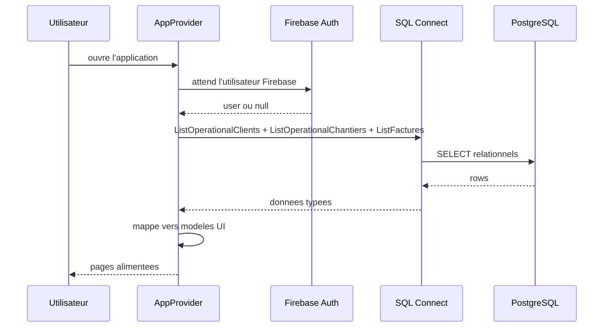
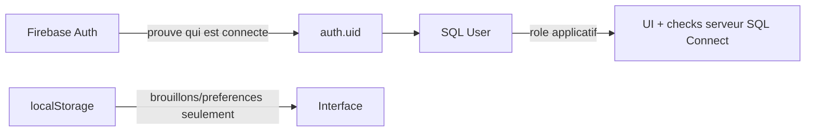
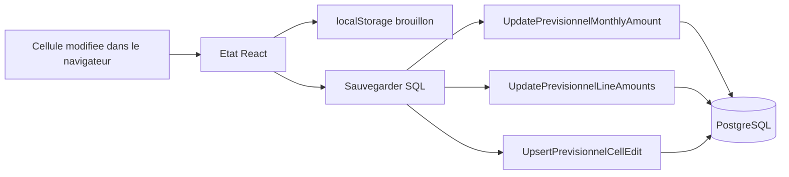
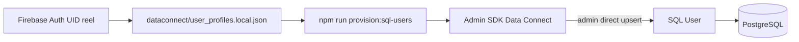

# 05 - SQL Connect, backend et base de donnees

> Statut: stable local checkpoint 002  
> Derniere revision: 2026-05-17  
> Public vise: developpeur junior qui doit comprendre comment le backend Sosson fonctionne aujourd'hui.  
> Source de verite technique: `dataconnect/schema/schema.gql`, `dataconnect/sosson/queries.gql`, `dataconnect/sosson/mutations.gql`.

## 0. Resume en une phrase

SQL Connect est la couche qui permet au front React de lire et ecrire dans une base PostgreSQL Cloud SQL via des operations GraphQL typees, tout en restant dans l'ecosysteme Firebase Auth.

Dit autrement:

```text
React/Vite
  -> SDK SQL Connect genere
    -> Firebase SQL Connect
      -> Cloud SQL PostgreSQL
        -> tables User, Client, Chantier, Facture, Documents, Previsionnel, Email, Planning, Rapports, Analytics, Audit/Checkpoints
```

## 1. Pourquoi SQL Connect existe dans Sosson

Sosson manipule des donnees relationnelles:

- un client a plusieurs chantiers;
- un chantier appartient a un client;
- une facture appartient a un chantier;
- un document peut etre lie a un client, un chantier ou une facture;
- une ligne du tableur previsionnel est liee a un exercice, un client, parfois un chantier;
- un montant mensuel appartient a une ligne previsionnelle.

Ce type de donnees est plus propre dans une base relationnelle que dans un store document. C'est pour cela que SQL Connect / PostgreSQL est la cible metier.

Firestore reste present, mais il ne doit pas devenir la source de verite metier. Aujourd'hui il sert encore transitoirement au profil utilisateur dans `src/lib/auth.ts`.

## 2. Les briques du backend actuel

```mermaid
flowchart LR
  A[React / Vite] --> B[src/lib/dataconnect.ts]
  B --> C[SDK genere @dataconnect/generated]
  C --> D[Firebase SQL Connect]
  D --> E[(Cloud SQL PostgreSQL fdcdb)]
  A --> F[Firebase Auth]
  F --> D
  A --> G[Firestore transitoire users/{uid}]
  A --> H[localStorage fallback / brouillons]
```

### Roles des briques

| Brique | Role | Etat actuel |
|---|---|---|
| React/Vite | Interface utilisateur | Active. |
| Firebase Auth | Connexion utilisateur | Active. |
| SQL Connect | API GraphQL typee vers Postgres | Active, partiellement branchee au front. |
| Cloud SQL PostgreSQL | Base relationnelle | Cible metier. |
| Firestore | Profil utilisateur transitoire | Encore utilise, a remplacer par SQL `User`. |
| Firebase Storage | Fichiers documents/factures | Cible, pas encore branche produit. |
| localStorage | Brouillons / fallback local | Encore trop utilise. |

## 3. Arbre des fichiers importants

```text
dataconnect/
  dataconnect.yaml
  schema/
    schema.gql
  sosson/
    connector.yaml
    queries.gql
    mutations.gql
  seed_data.gql
  previsionnel_seed_data.gql
  previsionnel_seed/
    0001_importBatch.gql
    ...
    0113_lots018.gql

src/
  lib/
    firebase.ts
    dataconnect.ts
    firebaseAuthState.ts
    auth.ts
    store.tsx
  features/
    auth/
    operations/
    factures/
    documents/
    previsionnel/
    audit/
    email/
    planning/
    reports/
    analytics/
  dataconnect-generated/
  dataconnect-admin-generated/
  pages/
    DashboardPage.tsx
    ClientsPage.tsx
    ChantiersPage.tsx
    FacturesPage.tsx
    DocumentsPage.tsx
    PrevisionnelSpreadsheetPage.tsx
    StatistiquesPage.tsx

scripts/
  seed-dataconnect-local.mjs
  verify-dataconnect-local.mjs
  generate-previsionnel-seed.mjs
  seed-previsionnel-dataconnect-local.mjs
  verify-previsionnel-dataconnect-local.mjs
```

## 4. Les fichiers Data Connect

### `dataconnect/dataconnect.yaml`

Ce fichier dit a Firebase:

- quel service SQL Connect utiliser;
- quelle region utiliser;
- quelle instance Cloud SQL utiliser;
- ou trouver le schema;
- ou trouver les connecteurs.

Etat actuel:

```text
serviceId: sosson-sandbox-service
location: europe-west9
database: fdcdb
instance: sosson-sandbox-instance
```

Important: ce fichier pointe aujourd'hui sur la sandbox.

### `dataconnect/schema/schema.gql`

C'est le modele relationnel. Il decrit les tables.

Quand tu lis:

```graphql
type Client @table {
  nom: String!
  email: String
}
```

Tu peux le comprendre comme:

```sql
CREATE TABLE Client (
  id uuid primary key,
  nom text not null,
  email text null
);
```

SQL Connect genere les vrais objets SQL/migrations a partir de ce schema.

### `dataconnect/sosson/queries.gql`

C'est la liste des lectures autorisees.

Exemples:

- `GetCurrentUser`
- `ListUsers`
- `ListOperationalClients`
- `GetClient`
- `ListOperationalChantiers`
- `GetChantier`
- `ListFactures`
- `ListDocumentsAttaches`
- `ListPrevisionnelExercises`
- `ListPrevisionnelLinesByExercise`
- `ListCheckpointRuns`
- `GetCheckpointRun`
- `ListDataImportRuns`
- `ListRecentAuditEvents`
- `ListEmailThreads`
- `GetEmailThread`
- `ListPlanningEventsByPeriod`
- `ListAnalyticsSnapshots`
- `ListRapports`

### `dataconnect/sosson/mutations.gql`

C'est la liste des ecritures autorisees.

Exemples:

- `CreateClient`
- `UpdateClient`
- `CreateChantier`
- `UpdateChantierStatut`
- `CreateFacture`
- `SetFactureStatut`
- `CreateDocumentAttache`
- `UpdatePrevisionnelMonthlyAmount`
- `UpsertPrevisionnelCellEdit`
- `CreateCheckpointRun`
- `CreateCheckpointStep`
- `CreateCheckpointArtifact`
- `CreateCheckpointDecision`
- `CreateDataImportRun`
- `CreateAuditEvent`
- `CreateEmailThread`
- `CreateEmailMessage`
- `CreatePlanningEvent`
- `CreateAnalyticsSnapshot`
- `CreateRapport`

Les mutations sensibles sont maintenant protegees par deux niveaux:

- `@auth(level: USER)`: l'utilisateur doit etre connecte via Firebase Auth;
- sous-lecture `User` SQL + `@check` sur `role`: l'utilisateur doit avoir un profil applicatif SQL avec le role attendu.

Le profil SQL `User` n'est plus provisionne par une mutation exposee au navigateur. Le script admin utilise l'Admin SDK Data Connect (`dc.upsert('User', ...)`) depuis un environnement controle.

### `dataconnect/sosson/connector.yaml`

Ce fichier dit ou generer les SDKs:

```text
src/dataconnect-generated/
src/dataconnect-admin-generated/
```

Ces dossiers sont generes automatiquement. On ne les modifie pas a la main.

## 5. Le schema actuel, table par table

### Vue generale



## 6. Socle operationnel

### `User`

Represent un utilisateur interne.

Champs importants:

- `id`: Firebase Auth UID.
- `email`
- `nom`
- `prenom`
- `role`: `gerant`, `assistante`, `chef_chantier`.
- `avatar`

Etat actuel:

- La table existe.
- `GetCurrentUser` existe.
- `ListUsers` existe pour lire les profils applicatifs provisionnes depuis la page Equipe, sans mutation de role cote navigateur.
- Le login tente maintenant `GetCurrentUser` avant Firestore via `src/features/auth/sqlUserProfile.ts`.
- Firestore `users/{uid}` reste un fallback transitoire tant que les vrais profils SQL sandbox ne sont pas provisionnes.
- Le fallback local seed est uniquement un mode developpement opt-in, pas un mecanisme sandbox/production.

Point restant:

Le provisioning SQL `User` passe par script admin local/sandbox. Il doit etre execute uniquement apres validation humaine sur sandbox, avec des UID Firebase Auth reels.

### `Client`

Represent un donneur d'ordre.

Champs:

- `origineImport`: `operationnel` par defaut, `previsionnel` pour les clients crees par l'import Excel.
- `type`: particulier / professionnel / public.
- `nom`
- `email`
- `telephone`
- `adresse`
- `ville`
- `codePostal`
- `dateCreation`

Relations:

```text
Client 1 -> N Chantier
Client 1 -> N ClientAlias
Client 1 -> N PrevisionnelLine
Client 1 -> N DocumentAttache
```

### `Chantier`

Represent un dossier operationnel.

Champs:

- `origineImport`: `operationnel` par defaut, `previsionnel` pour les chantiers historiques issus de l'import Excel.
- `client`: lien obligatoire vers `Client`.
- `chefChantier`: lien optionnel vers `User`.
- `nom`
- `statut`: en cours / cloture / en attente.
- `dateDebut`
- `dateFinPrevue`
- `dateFin`
- `budgetPrevisionnel`
- `description`
- `adresse`

Relations:

```text
Chantier N -> 1 Client
Chantier N -> 0/1 User
Chantier 1 -> N Facture
Chantier 1 -> N DocumentAttache
Chantier 0/1 -> N PrevisionnelLine
```

### `Facture`

Represent une facture fournisseur.

Champs:

- `chantier`: lien obligatoire vers `Chantier`.
- `fournisseur`
- `numeroFacture`
- `montantHT`
- `tva`
- `montantTTC`
- `date`
- `categorie`
- `statut`: validee / en_attente / rejetee.
- `description`

Important:

Le `montantTTC` est stocke en dur, pas recalcule automatiquement. C'est volontaire: on veut garder le montant reel facture par le fournisseur.

## 7. Documents

### `DocumentFolder`

Represent un dossier de rangement.

Un dossier peut etre:

- global;
- enfant d'un autre dossier;
- lie a un client;
- lie a un chantier.

### `DocumentAttache`

Represent les metadonnees d'un fichier.

Le fichier binaire doit vivre dans Firebase Storage, mais ce n'est pas encore completement branche.

Champs:

- `folder`
- `client`
- `chantier`
- `facture`
- `nomFichier`
- `storagePath`
- `mimeType`
- `tailleBytes`
- `sha256`
- `typeDocument`
- `statut`
- `source`
- `dateDocument`

Etat actuel:

- La table existe.
- La page Documents peut creer des metadonnees avec chemin pending, taille et hash SHA-256 calcule depuis le fichier selectionne.
- Les vrais fichiers ne sont pas encore envoyes dans un flux Storage produit.
- `storage.rules` est volontairement durci en deny par defaut tant que ce flux n'est pas propre.

## 8. Previsionnel et Excel

### Question centrale: est-ce que le Excel / tableur figure dans la base ?

Reponse courte: oui, une partie importante du tableur previsionnel est modelisee dans SQL Connect, mais le fichier Excel lui-meme n'est pas stocke comme fichier binaire dans PostgreSQL.

Ce qui est en base:

- les exercices du classeur;
- les clients detectes;
- les alias de clients;
- les chantiers issus du previsionnel;
- les lignes du tableur;
- les montants mensuels;
- les montants par lot;
- les overrides de cellules modifiees dans le tableur web.

Ce qui n'est pas en base:

- le fichier `.xlsx` original comme binaire;
- toute la mise en forme Excel;
- toutes les formules Excel comme moteur de calcul;
- les documents/fichiers attaches tant que Storage n'est pas branche.

### Flux Excel -> base



### Les tables previsionnelles

#### `PrevisionnelImportBatch`

Represent un import du classeur.

Champs:

- `workbook`: nom du fichier.
- `sourcePath`: chemin source connu au moment de generation.
- `workbookHash`: hash du fichier pour savoir si la source a change.
- `importedAt`
- `notes`

#### `PrevisionnelExercise`

Represent un onglet/exercice, par exemple `2025-26`.

Champs:

- `sheet`
- `exercise`
- `startYear`
- `endYear`
- `lineCount`
- `chantierCount`
- `caPrevision`
- `caContrat`
- `plannedTotal`
- `realizedTotal`
- `invoicedTotal`

#### `ClientAlias`

Permet de rapprocher les noms Excel des clients canoniques.

Exemple mental:

```text
"DURAND M." -> Client "Durand Michel"
"DURAND MICHEL" -> Client "Durand Michel"
"DURAND PARIS" -> Client "Durand Michel"
```

#### `PrevisionnelLine`

Represent une ligne du tableur.

Champs importants:

- `exercise`: exercice parent.
- `client`: client rapproche.
- `chantier`: chantier rapproche si possible.
- `sourceSheet`: onglet Excel.
- `sourceRow`: numero de ligne Excel.
- `rawName`: nom brut lu dans Excel.
- `clientKey`
- `clientName`
- `category`
- `lineType`
- `caTce`
- `caPrevision`
- `caContrat`
- `plannedTotal`
- `realizedTotal`
- `invoicedTotal`
- `invoiceSentTotal`

#### `PrevisionnelMonthlyAmount`

Represent les montants mensuels d'une ligne.

Champs:

- `line`: ligne parente.
- `month`
- `label`
- `monthOrder`
- `planned`
- `realized`
- `invoiceSent`

Important: `invoiceSent` vient des cellules jaunes du fichier Excel. Cela signifie facture envoyee, pas paiement encaisse.

#### `PrevisionnelLotAmount`

Represent les montants par lot / corps d'etat.

Exemples:

- menuiserie;
- plomberie;
- electricite;
- peinture;
- autre lot selon le fichier source.

#### `PrevisionnelCellEdit`

Represent une cellule modifiee dans le tableur web.

Pourquoi cette table existe ?

Parce que le modele analytique mensuel/lots ne suffit pas toujours a reconstruire exactement un tableur. Cette table garde les overrides cellule par cellule.

Champs:

- `id`: identifiant stable, souvent derive de feuille + cellule.
- `sourceSheet`
- `cellRef`: exemple `B12`.
- `valueText`
- `numericValue`
- `dateModification`

## 8.1 Audit, checkpoints et imports

Un premier lot local non destructif ajoute les tables suivantes au schema:

- `AuditEvent`
- `CheckpointRun`
- `CheckpointStep`
- `CheckpointArtifact`
- `CheckpointDecision`
- `DataImportRun`
- `DataImportIssue`
- `EntityChangeLog`

Intention:

- SQL indexe les preuves, statuts, chemins, hashes, auteurs et environnements.
- Les gros logs, exports, PDF, Excel et artefacts lourds restent hors SQL.
- Les operations exposees sont append-only: creation et lecture uniquement.
- Aucune mutation d'update/delete n'est exposee pour ces journaux.

Etat de validation:

- Prepare localement dans `dataconnect/schema/schema.gql`.
- Operations ajoutees dans `queries.gql` et `mutations.gql`.
- SDKs regeneres avec `firebase dataconnect:sdk:generate`.
- Adapter applicatif initialise dans `src/features/audit/auditSql.ts`.
- Verification emulateur dediee: `npm run verify:checkpoint-audit:dataconnect`.
- Orchestration locale: `npm run checkpoint:002:emulator` lance cette verification apres seeds, garde operationnel/previsionnel, comptage propre et snapshot analytics local, avant RBAC.
- Preuve locale du 2026-05-17: ecriture/relecture SQL de `CheckpointRun`, `CheckpointStep`, `CheckpointArtifact`, `CheckpointDecision`, `DataImportRun`, `DataImportIssue`, `AuditEvent` et `EntityChangeLog` dans l'emulateur; artefact `tmp/checkpoint-002/checkpoint-audit-local.json`.
- Non deploye en sandbox distante.
- Non valide en production.

## 8.2 Emails, planning, rapports et analytics

Un deuxieme lot local non destructif prepare les tables metier qui manquaient pour sortir des placeholders et du localStorage:

- `EmailThread`
- `EmailMessage`
- `EmailAttachment`
- `PlanningEvent`
- `PlanningAssignment`
- `AnalyticsSnapshot`
- `Rapport`

Intention:

- Outlook / Graph reste la source externe email.
- SQL garde l'index metier utile: sujet, statut, lien client/chantier, affectation, chemins et hashes.
- Storage garde les corps lourds, pieces jointes et exports quand necessaire.
- Le planning devient une source relationnelle liee aux chantiers et aux utilisateurs.
- Les rapports s'appuient sur des snapshots analytiques reproductibles.

Etat de validation:

- Prepare localement dans `dataconnect/schema/schema.gql`.
- Operations ajoutees dans `queries.gql` et `mutations.gql`.
- SDKs regeneres avec `firebase dataconnect:sdk:generate`.
- Adapters ajoutes:
  - `src/features/email/emailSql.ts`
  - `src/features/planning/planningSql.ts`
  - `src/features/reports/reportSql.ts`
  - `src/features/analytics/analyticsSql.ts`
- Adapter Equipe ajoute:
  - `src/features/team/teamSql.ts`
- Dashboard, Statistiques et Rapports lisent maintenant `AnalyticsSnapshot` quand SQL Connect est disponible; Rapports peut creer un brouillon metadata SQL.
- Preuve email locale du 2026-05-17: `npm run verify:email:dataconnect` via `checkpoint:002:emulator` cree un `EmailThread`, un `EmailMessage` et une `EmailAttachment`, classe le fil en `traite`, puis relit le tout; artefact `tmp/checkpoint-002/email-local.json`.
- Preuve statut chantier locale du 2026-05-17: `npm run verify:chantier-status:dataconnect` via `checkpoint:002:emulator` modifie puis restaure le statut d'un chantier operationnel seed via `UpdateChantierStatut`; artefact `tmp/checkpoint-002/chantier-status-local.json`.
- Preuve edition client locale du 2026-05-17: `npm run verify:client-update:dataconnect` via `checkpoint:002:emulator` modifie puis restaure un client operationnel seed via `UpdateClient`; artefact `tmp/checkpoint-002/client-update-local.json`.
- Preuve edition previsionnel locale du 2026-05-17: `npm run verify:previsionnel-edits:dataconnect` via `checkpoint:002:emulator` modifie puis restaure un montant mensuel seed via `UpdatePrevisionnelMonthlyAmount`, puis ecrit une cellule de preuve via `UpsertPrevisionnelCellEdit`; artefact `tmp/checkpoint-002/previsionnel-edits-local.json`. Cette preuve est lancee apres le snapshot analytics local pour ne pas influencer le snapshot.
- Preuve factures locale du 2026-05-17: `npm run verify:factures:dataconnect` via `checkpoint:002:emulator` cree une facture operationnelle locale via `CreateFacture`, la relit en `en_attente`, modifie son statut via `SetFactureStatut`, puis la relit en `validee`; artefact `tmp/checkpoint-002/factures-local.json`. Cette preuve est lancee apres le comptage propre pour ne pas fausser les compteurs seed.
- Preuve documents locale du 2026-05-17: `npm run verify:documents:dataconnect` via `checkpoint:002:emulator` cree un `DocumentFolder` et un `DocumentAttache`, relit `storagePath`, `tailleBytes` et `sha256`; artefact `tmp/checkpoint-002/documents-local.json`. Ce n'est pas encore un upload Storage.
- Preuve planning locale du 2026-05-17: `npm run verify:planning:dataconnect` via `checkpoint:002:emulator` cree un `PlanningEvent` + `PlanningAssignment`, modifie titre/equipe/statut/creneau/notes avec `UpdatePlanningEventDetails`, annule la carte via `CancelPlanningEvent` sans suppression physique, puis relit la carte; artefact `tmp/checkpoint-002/planning-local.json`.
- Preuve rapport locale du 2026-05-17: `npm run verify:reports:dataconnect` via `checkpoint:002:emulator` cree un `AnalyticsSnapshot`, ecrit un payload source JSON et un artefact CSV local sous `tmp/checkpoint-002/reports/`, cree un `Rapport`, le marque genere avec le chemin et le hash SHA-256 reels de cet artefact via `MarkRapportGenerated`, puis relit detail et liste; preuve `tmp/checkpoint-002/report-local.json`. Ce n'est pas encore un export Storage/PDF/XLSX.
- Preuve analytics locale du 2026-05-17: `npm run snapshot:analytics:dataconnect` via `checkpoint:002:emulator` cree puis relit un `AnalyticsSnapshot` `dashboard-global` en emulateur; artefact `tmp/checkpoint-002/analytics-snapshot-local.json`.
- Non deploye en sandbox distante.
- Non valide en production.

## 9. Combien de donnees previsionnelles sont prevues ?

D'apres `AGENTS.md` et les seeds generes:

```text
13 exercices
586 clients
616 alias
898 chantiers
898 lignes previsionnelles
1577 montants mensuels
887 montants par lot
```

Attention: ces chiffres decrivent le seed previsionnel genere. Ils ne garantissent pas que la sandbox distante contient deja toutes ces donnees tant qu'un seed sandbox n'a pas ete execute et verifie.

## 10. Seeds: ce qui peuple la base

### Seed simple

Fichier:

```text
dataconnect/seed_data.gql
```

Contenu attendu:

```text
3 clients
4 chantiers
12 factures
0 user
```

Pourquoi 0 user ?

Parce que `User.id` doit correspondre a un vrai Firebase Auth UID. On ne peut pas inventer proprement un UID dans un seed metier.

### Seed previsionnel

Fichier complet:

```text
dataconnect/previsionnel_seed_data.gql
```

Fichiers chunkes:

```text
dataconnect/previsionnel_seed/*.gql
```

Pourquoi des chunks ?

Parce que le seed previsionnel est gros. L'executer en petits fichiers est plus robuste.

## 11. Comment le front lit SQL Connect

### Initialisation

Fichier:

```text
src/lib/dataconnect.ts
```

Role:

- recuperer l'instance Data Connect;
- connecter l'emulateur en dev sandbox si configure;
- exposer `getSossonDataConnect()`;
- exposer `isDataConnectEnabled`.

### Store global

Fichier:

```text
src/lib/store.tsx
```

Flux actuel:



Si SQL Connect ne repond pas ou si aucune donnee n'est disponible, le front garde un fallback local/Excel.

## 12. Page par page: SQL ou local ?

| Page | SQL Connect aujourd'hui | Local / fallback aujourd'hui | Cible |
|---|---|---|---|
| Dashboard | Previsionnel SQL si disponible + lecture `AnalyticsSnapshot` non bloquante | Store + TS si SQL/snapshot absents | Hooks SQL communs + snapshots. |
| Clients | Lecture via store SQL et creation `CreateClient` si source Data Connect active | Previsionnel local + creation locale annoncee comme fallback | SQL `Client` + aliases. |
| Chantiers | Lecture via store SQL et creation `CreateChantier` si source Data Connect active | Previsionnel local + creation locale annoncee comme fallback | SQL `Chantier` operationnel. |
| Detail chantier | Chantier/factures via store SQL si actif + badges de source par bloc | images, timeline, documents, emails et planning encore locaux/statiques | `GetChantier` + docs/emails/planning SQL par chantier. |
| Factures | Creation/statut SQL si source active; blocage des factures locales en vue SQL; fichiers marques non durables | fallback local explicite hors source SQL | SQL par defaut + futur Storage facture. |
| Documents | Metadata SQL partielle avec chemin pending, taille et hash SHA-256; si SQL est actif, un echec d'ecriture ne cree plus de copie locale silencieuse | fichiers memoire/localStorage seulement en fallback; pas encore upload Storage | Storage + SQL. |
| Previsionnel tableur | Lecture/sauvegarde SQL | localStorage brouillon + checkpoints navigateur explicitement libelles locaux | SQL principal. |
| Statistiques | Previsionnel SQL + lecture `AnalyticsSnapshot` non bloquante | TS fallback si SQL/snapshot absents | Couche analytics partagee + snapshots. |
| Emails | Lecture `EmailThread` SQL et ecritures via adapter (`CreateEmailThread`, `CreateEmailMessage`, `CreateEmailAttachment`, `UpdateEmailThreadStatusAndLinks`) | Outlook local + seeds visibles comme fallback; pieces jointes Storage produit non finalisees | Backend Graph + index SQL complet + pieces jointes Storage. |
| Planning | Lecture `PlanningEvent` par periode, creation SQL d'evenement + assignment, modification/deplacement SQL via `UpdatePlanningEventDetails`, annulation soft via `CancelPlanningEvent` | localStorage visible seulement hors source SQL; conflits et historique fin non modelises | Modele SQL complet avec historique d'annulation/deplacement et conflits. |
| Rapports | Lecture `Rapport`, lecture snapshot analytics, creation de brouillon metadata SQL, preuve locale CSV + hash sous `tmp/` | brouillons locaux visibles comme fallback; pas encore Storage/PDF/XLSX | Jobs de generation PDF/Excel + Storage + hashes. |
| Equipe | Lecture `ListUsers` des profils SQL applicatifs | equipes, membres, conges et matrice droits en localStorage | Modele SQL/RBAC complet. |

## 13. Auth, roles et securite

### Ce qui est deja vrai

- Les operations SQL Connect demandent `@auth(level: USER)`.
- Donc il faut etre connecte via Firebase Auth.
- Les mutations sensibles lisent maintenant `User(id = auth.uid)` cote serveur et bloquent si le profil SQL ou le role attendu manque.
- Les regles Firestore/Storage du repo sont maintenant durcies par defaut.
- Le fallback dev local est uniquement opt-in et interdit en production.
- Depuis la roadmap post-audit, le login tente d'abord de charger le profil applicatif avec `GetCurrentUser`.

### Ce qui n'est pas encore suffisant

Le RBAC SQL Connect local couvre les mutations principales, mais il reste a le valider sur sandbox avec de vrais comptes Firebase Auth et de vrais profils SQL `User`.
Il faut aussi garder en tete:

```text
Connecte Firebase != autorise a tout faire
```

Les roles utilises sont:

- `gerant`: toutes les mutations sensibles;
- `assistante`: clients, chantiers, factures, documents, previsionnel;
- `chef_chantier`: chantiers et documents.

Les controles UI restent utiles pour l'ergonomie, mais la securite doit venir du serveur. Les checks actuels doivent etre deployes et prouves sur sandbox avant production.

### Difference entre identite, profil et autorisation



- Firebase Auth = identite technique: email, session, UID, connexion/deconnexion.
- SQL `User` = profil applicatif Sosson: nom, prenom, role interne, avatar.
- Firestore `users/{uid}` = fallback transitoire tant que tous les profils SQL ne sont pas provisionnes.
- localStorage = cache, brouillons ou preferences. Il ne doit jamais prouver un droit.

### Provisioning SQL `User`

Le navigateur ne doit jamais choisir son role. Le connecteur client n'expose donc plus de mutation `UpsertCurrentUser`.

Le provisioning passe par:

1. `dataconnect/user_profiles.local.json`, ignore par git;
2. `scripts/provision-sql-users.mjs`;
3. Admin SDK Data Connect `dc.upsert('User', ...)`.

Le front lit `GetCurrentUser` et ne peut pas fournir `$role` a une mutation publique.

## 14. Emulateur local vs sandbox

### Emulateur local

Utilise pour tester SQL Connect sans toucher la sandbox distante.

Commandes:

```bash
npm run emulators:dataconnect
npm run seed:dataconnect
npm run verify:dataconnect
```

Pour le checkpoint 002 local, utiliser plutot l'orchestrateur complet avec deux terminaux:

```bash
# Terminal 1
npm run emulators:dataconnect

# Terminal 2
npm run checkpoint:002:emulator
```

Cette commande injecte les seeds localement, verifie les listes operationnelles et le previsionnel, prouve que le seed previsionnel ne remonte pas dans les listes operationnelles, modifie puis restaure un statut chantier via `UpdateChantierStatut`, modifie puis restaure un client via `UpdateClient`, cree et relit un profil SQL `User` local via `ListUsers`, cree et relit des traces email/planning/rapport SQL locales, archive un comptage local propre sous `tmp/checkpoint-002/counts-local.json`, cree un `AnalyticsSnapshot` SQL local avant les donnees documents/RBAC de test, cree et relit une preuve documents SQL locale avec `sha256` et lien facture, lance la verification RBAC locale, puis ecrit et relit la trace checkpoint/audit SQL.

Preuves locales attendues:

- `tmp/checkpoint-002/counts-local.json`: comptage local propre avant RBAC et traces.
- `tmp/checkpoint-002/operational-boundary-local.json`: preuve que les listes operationnelles restent limitees au seed operationnel apres import previsionnel.
- `tmp/checkpoint-002/chantier-status-local.json`: statut chantier seed modifie puis restaure via `UpdateChantierStatut`.
- `tmp/checkpoint-002/client-update-local.json`: client seed modifie puis restaure via `UpdateClient`.
- `tmp/checkpoint-002/previsionnel-edits-local.json`: montant mensuel seed modifie/restaure via `UpdatePrevisionnelMonthlyAmount` et cellule de preuve ecrite via `UpsertPrevisionnelCellEdit`.
- `tmp/checkpoint-002/factures-local.json`: facture locale creee via `CreateFacture`, puis statut modifie via `SetFactureStatut`.
- `tmp/checkpoint-002/team-users-local.json`: profil SQL `User` local cree puis relu via `ListUsers`.
- `tmp/checkpoint-002/email-local.json`: fil, message et piece jointe email metadata crees puis relus.
- `tmp/checkpoint-002/documents-local.json`: dossier document et metadata fichier crees puis relus avec `storagePath`, `tailleBytes` et `sha256`.
- `tmp/checkpoint-002/planning-local.json`: carte planning et affectation creees, carte modifiee puis relue.
- `tmp/checkpoint-002/report-local.json`: rapport cree, artefact CSV local hashe, rapport marque genere avec chemin/hash, puis relu.
- `tmp/checkpoint-002/analytics-snapshot-local.json`: snapshot analytics SQL cree puis relu.
- `tmp/checkpoint-002/checkpoint-audit-local.json`: checkpoint, etape, preuve, decision, import, audit et change log crees puis relus.

L'etat de l'emulateur peut persister dans `dataconnect/.dataconnect/pgliteData`. Si le comptage local est pollue par une verification RBAC precedente, arreter l'emulateur puis supprimer explicitement l'etat local:

```bash
npm run reset:dataconnect:local -- --yes-local-reset
```

Ce reset ne touche pas a Firebase sandbox ni production et refuse de s'executer si l'emulateur ecoute encore sur `127.0.0.1:9399`.

Previsionnel:

```bash
npm run seed:previsionnel:generate
npm run seed:previsionnel:dataconnect
npm run verify:previsionnel:dataconnect
```

Si l'emulateur n'est pas lance, les verify scripts echouent avec:

```text
ECONNREFUSED 127.0.0.1:9399
```

Ce n'est pas une erreur du schema. Cela veut simplement dire que le serveur local SQL Connect n'ecoute pas.

### Sandbox Firebase

Projet:

```text
sosson-sandbox
```

Deploy Data Connect connu:

```bash
firebase deploy --only dataconnect --project sosson-sandbox
```

Seed sandbox prepare, sans mutation distante:

```bash
npm run seed:sandbox -- --dry-run --kind=all --output=tmp/checkpoint-002/seed-sandbox-dry-run.json
```

Execution reelle sandbox, seulement apres validation humaine explicite:

```bash
ALLOW_SANDBOX_DATACONNECT_SEED=true npm run seed:sandbox -- --sandbox --yes-sandbox --kind=all
```

Le dry-run archive la liste des fichiers a executer. Le 2026-05-17, cette liste contient 113 fichiers: `dataconnect/seed_data.gql` puis les chunks `dataconnect/previsionnel_seed/*.gql`.

Le seed reel ne suffit pas a valider checkpoint 002: il doit etre suivi d'un comptage sandbox archive et d'une verification des vrais profils SQL `User`.

Ne pas deployer production tant que la checklist production readiness n'est pas verte.

## 15. SDKs generes

Quand SQL Connect genere le SDK, il cree:

```text
src/dataconnect-generated/
src/dataconnect-admin-generated/
```

Le front importe par exemple:

```ts
import { listOperationalClients, listOperationalChantiers, listFactures } from '@dataconnect/generated'
```

Les scripts Node admin importent:

```ts
import { listOperationalClients } from '@dataconnect/admin-generated'
```

Regle absolue:

```text
Ne jamais modifier ces dossiers a la main.
```

Si `schema.gql`, `queries.gql` ou `mutations.gql` change, il faut regenerer proprement.

## 16. Exemple complet: afficher les factures

### 1. La table

`Facture` existe dans `schema.gql`.

### 2. La query

`ListFactures` existe dans `queries.gql`.

Elle retourne:

- facture;
- chantier;
- client du chantier.

### 3. Le SDK

SQL Connect genere une fonction `listFactures`.

### 4. Le store

`src/lib/store.tsx` appelle:

```ts
listFactures(dc)
```

### 5. Le mapping

Le store transforme les rows SQL en modeles UI `Facture`.

### 6. La page

`src/pages/FacturesPage.tsx` lit `factures` depuis `useApp()`.

### Flux mental

```text
Postgres Facture
  -> Query ListFactures
    -> SDK listFactures()
      -> store mapFactures()
        -> FacturesPage
```

## 17. Exemple complet: modifier le tableur previsionnel

### Lecture

La page `PrevisionnelSpreadsheetPage`:

1. liste les exercices avec `ListPrevisionnelExercises`;
2. choisit l'exercice `2025-26`;
3. charge les lignes avec `ListPrevisionnelLinesByExercise`;
4. charge les overrides avec `ListPrevisionnelCellEdits`;
5. fusionne SQL + template local + localStorage brouillon.

### Ecriture

Quand tu sauvegardes:

- les montants mensuels vont dans `PrevisionnelMonthlyAmount`;
- les totaux de ligne peuvent aller dans `PrevisionnelLine`;
- les changements exacts de cellules vont dans `PrevisionnelCellEdit`.



## 18. Ce qui est construit aujourd'hui vs ce qui manque

### Construit

- Schema relationnel reel.
- Queries principales.
- Mutations principales.
- SDKs generes.
- Store React qui sait lire clients/chantiers/factures.
- Tableur previsionnel partiellement vivant avec SQL.
- Documents metadata partiels.
- Scripts seed et verify locaux.
- Adapters initiaux:
  - `src/features/auth/sqlUserProfile.ts` mappe `GetCurrentUser` vers le profil applicatif front.
  - `src/features/team/teamSql.ts` lit les profils SQL `User` pour la page Equipe sans exposer de mutation role.
  - `src/features/operations/operationalAdapters.ts` mappe les lignes SQL `Client`, `Chantier`, `Facture` vers les modeles UI.
  - `src/features/factures/factureSql.ts` concentre les mutations SQL factures hors page React.
  - `src/features/documents/storagePaths.ts` prepare les chemins Storage canoniques en attente.
  - Le previsionnel dispose deja d'une couche de transformation dans `src/lib/previsionnelModel.ts`, a migrer ensuite vers `src/features/previsionnel/`.

### Manquant / incomplet

- Profil utilisateur SQL completement valide en sandbox distante.
- RBAC serveur deploye et valide sur sandbox distante.
- Separation operationnel vs historique previsionnel validee sur sandbox distante.
- Pagination serveur robuste.
- Storage documents produit.
- CI distante verte sur PR/push.
- Observabilite.
- Production readiness.

Mise a jour post-audit: le login tente maintenant `GetCurrentUser` en premier, puis Firestore reste un fallback transitoire documente. Le profil SQL n'est pas encore considere "termine" tant qu'un vrai `User` sandbox n'a pas ete provisionne et verifie.

## 18.1 Donnees operationnelles vs historique previsionnel

Le point a ne pas rater: les tables principales `Client` et `Chantier` servent a deux usages, maintenant separes par le champ `origineImport`.

| Usage | Exemple | Risque actuel | Cible checkpoint 002 |
|---|---|---|---|
| Operationnel vivant | client actif, chantier en cours, factures fournisseur | Les listes metier ne doivent pas afficher tout l'historique Excel. | `origineImport = "operationnel"` et listes `ListOperationalClients` / `ListOperationalChantiers` filtrees. |
| Historique previsionnel Excel | anciens onglets, lignes importees, alias | Le seed previsionnel cree beaucoup d'entites. | `origineImport = "previsionnel"` + tables previsionnelles comme source analytique. |

Schema applique localement:

```graphql
type Client @table {
  origineImport: String! @default(value: "operationnel")
}

type Chantier @table {
  origineImport: String! @default(value: "operationnel")
}
```

Le seed simple s'appuie sur la valeur par defaut `operationnel`.
Le generateur previsionnel ecrit explicitement `origineImport: "previsionnel"` pour les clients et chantiers crees depuis Excel.
Les queries `ListOperationalClients` et `ListOperationalChantiers` filtrent maintenant `origineImport = "operationnel"`.

Decision technique restante pour checkpoint 002:

1. Valider cette migration sur sandbox avant deploy.
2. Valider en sandbox que les adapters front consomment bien `ListOperationalClients` / `ListOperationalChantiers`.
3. Ajouter ensuite, si necessaire, des queries dediees pour explorer l'historique previsionnel hors pages operationnelles.

## 18.2 Provisioning SQL `User`

Le profil applicatif cible est SQL `User`, mais il ne doit pas etre cree depuis le navigateur.

Le repo fournit maintenant:

```text
dataconnect/user_profiles.example.json
scripts/provision-sql-users.mjs
```

Flux local:



Points de securite:

- `user_profiles.local.json` est ignore par git.
- Le fichier ne contient aucun mot de passe ni secret.
- Le role vient du fichier admin local, pas du navigateur.
- La cible sandbox distante demande une variable explicite `ALLOW_SANDBOX_USER_PROVISIONING=true` et le flag `--yes-sandbox`.
- Le connecteur client ne contient plus `UpsertCurrentUser`.

## 18.3 RBAC serveur SQL Connect

Les mutations sensibles sont maintenant des operations multi-etapes:

```graphql
mutation CreateClient(...) @auth(level: USER) @transaction {
  query {
    currentUser: user(key: { id_expr: "auth.uid" })
      @check(expr: "this != null", message: "Profil SQL requis.")
      @redact {
      role @check(expr: "this in ['gerant', 'assistante']")
    }
  }

  client_insert(...)
}
```

Le champ `currentUser` est masque par `@redact`: il sert au controle, pas a la reponse client.

Matrice serveur locale:

| Domaine mutation | Roles autorises |
|---|---|
| Clients | `gerant`, `assistante` |
| Chantiers | `gerant`, `assistante`, `chef_chantier` |
| Factures | `gerant`, `assistante` |
| Documents | `gerant`, `assistante`, `chef_chantier` |
| Previsionnel editable/import | `gerant`, `assistante` |

Preuve locale:

```bash
npm run verify:dataconnect:rbac
```

Resultat attendu:

- une `assistante` peut creer un client;
- un `chef_chantier` ne peut pas creer un client;
- un `chef_chantier` peut creer un dossier document.

## 19. Les pieges a eviter

### Piege 1: croire que Firebase Auth suffit

Firebase Auth prouve l'identite. Il ne prouve pas le droit metier.

### Piege 2: croire que localStorage securise quelque chose

localStorage est modifiable par l'utilisateur. Il sert aux preferences ou brouillons, pas a l'autorisation.

### Piege 3: modifier le SDK genere

Le SDK est une sortie de generation. Toute modification manuelle sera ecrasee.

### Piege 4: melanger Excel historique et chantier vivant

Le seed previsionnel cree beaucoup de clients/chantiers historiques. Il faut eviter que l'interface operationnelle les traite tous comme des chantiers actifs.

### Piege 5: stocker des fichiers dans Postgres

Postgres garde les metadonnees. Les fichiers binaires doivent aller dans Storage.

## 20. Glossaire rapide

| Terme | Definition |
|---|---|
| SQL Connect | Couche Firebase qui expose une base Postgres via operations GraphQL typees. |
| Cloud SQL | Service Google qui heberge PostgreSQL. |
| Schema | Definition des tables et relations. |
| Query | Lecture autorisee. |
| Mutation | Ecriture autorisee. |
| SDK genere | Code TypeScript genere par SQL Connect pour appeler queries/mutations. |
| Seed | Fichier qui injecte des donnees initiales. |
| Emulator | Serveur local qui simule SQL Connect. |
| Sandbox | Projet Firebase de test reel. |
| Production | Projet final, pas encore valide. |

## 21. Checklist pour comprendre une donnee

Quand tu vois une donnee dans l'app, pose ces questions:

1. Est-ce que la page importe `@dataconnect/generated` ?
2. Est-ce que la page lit `useApp()` ?
3. Est-ce que le store a charge SQL Connect ?
4. Est-ce que la donnee existe dans `src/data/*` ?
5. Est-ce que la donnee est en localStorage ?
6. Est-ce que la table existe dans `schema.gql` ?
7. Est-ce qu'une query existe dans `queries.gql` ?
8. Est-ce qu'une mutation existe dans `mutations.gql` ?

Si tu peux repondre a ces questions, tu sais d'ou vient la donnee et ou elle devrait aller.

## 22. Prochaine etape recommandee

La prochaine vraie fondation backend est:

```text
Firebase Auth
  -> GetCurrentUser SQL
    -> role SQL controle
      -> mutations autorisees par role serveur
```

Ensuite seulement, le front pourra sortir proprement du mode hybride local/SQL.
