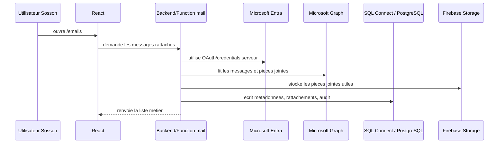

# Chapitre 06 - Integrations externes

> **Statut** : chapitre courant, enrichi post-audit checkpoint 001
> **Derniere revision** : 2026-05-17
> **Prérequis** : [02 — Architecture](02-architecture.md), [03 — Données](03-data-architecture.md)
> **ADRs référencés** : [0003](adr/0003-genkit-ai-layer.md), [0008](adr/0008-architecture-postgres-firestore-hybrid.md)

---

## 6.1 Carte des integrations

Sosson ne vit pas en vase clos. L'entreprise peut avoir Outlook, un agenda externe, un logiciel comptable, des dossiers Drive/Dropbox, des fichiers Excel et des historiques eparpilles. Ce chapitre pose la carte des integrations sans pretendre que tout est deja implemente.

| Integration | Role | Statut reel |
|---|---|---|
| Outlook / Microsoft Graph | Lire et envoyer les emails de la boite entreprise cible. | Preuve locale validee, production non prete. |
| Microsoft Entra / Azure | App Registration, OAuth, permissions Graph, secret cote serveur. | Configure en test local, a refaire proprement pour l'entreprise. |
| Gmail | Hypothese historique mail. | Conservee ci-dessous comme alternative, pas decision courante. |
| Google Calendar | Miroir planning futur. | Spec cible, non implemente. |
| Logiciel comptable | Import/export factures et depenses. | A specifier selon l'outil reel du comptable. |
| Stockage cloud existant | Migration one-shot Drive/Dropbox/WhatsApp. | A planifier, pas de sync continue prevue. |
| Excel | Ingestion/import/export de fichiers metier. | Previsionnel deja modelise en partie via SQL Connect. |

Regles de lecture:

- le mail courant part de Microsoft Graph, pas de Gmail;
- Gmail reste une option historique ou alternative si l'entreprise confirme que la boite officielle reste Google Workspace;
- aucune integration mail hebergee n'est encore prete production;
- aucun secret Microsoft, Google ou comptable ne doit entrer dans React, les seeds ou la documentation.

## 6.2 Microsoft Graph, Azure et mails

### 6.2.1 Decision courante

La piste mail active est Outlook / Microsoft Graph:

- une boite Outlook de developpement a servi a valider le parcours;
- une App Registration Microsoft Entra `Sosson Email Test` a ete creee pour le test;
- OAuth, `Mail.Read` et `Mail.Send` ont ete valides localement;
- le secret client Microsoft doit rester cote serveur ou local de developpement, jamais dans une variable `VITE_`.

La preuve complete est documentee dans [11 - Module email Outlook / Microsoft Graph](11-outlook-graph-email.md). Le kit de reprise produit est dans [Kit Outlook / Microsoft Graph](outlook-mail-kit.md).

### 6.2.2 Flux cible



### 6.2.3 Ce qui doit rester cote serveur

| Element | Front React | Backend / Secret Manager |
|---|---:|---:|
| Tenant ID / client ID public | Possible si non secret | Oui |
| Client secret Microsoft | Non | Oui |
| Refresh token / credential durable | Non | Oui |
| Appels Graph sensibles | Non | Oui |
| Rattachement chantier/client | Lecture UI uniquement | Ecriture controlee |

### 6.2.4 Gates avant production

- recreer l'App Registration avec le compte/tenant officiel de l'entreprise;
- limiter les permissions Microsoft Graph au strict besoin;
- stocker les secrets dans Secret Manager ou equivalent backend, jamais dans `.env.sandbox` public ni dans React;
- creer les tables SQL mail/audit avant de brancher `/emails` sur des donnees reelles;
- definir une politique de retention des emails et pieces jointes;
- valider le consentement administrateur Microsoft;
- documenter la procedure de rotation du secret;
- verifier les logs sans exposer email complet, token ou piece jointe sensible.

## 6.3 Gmail historique / alternative

Cette section est conservee pour ne pas perdre le travail d'architecture initial. Elle ne represente plus la decision mail courante tant que l'entreprise ne confirme pas une boite Google Workspace officielle.

### 6.3.1 Cas d'usage

- Toute la correspondance entreprise transite par la boîte Gmail principale (ex. `contact@sosson-btp.fr`).
- Sosson **aspire en temps réel** les emails entrants, les trie, les rattache automatiquement à un Client / Chantier si possible.
- La timeline de la fiche client agrège les emails ↔ les appels ↔ les devis ↔ les visites chantier.
- L'assistante voit en priorité les emails classés `URGENT` et la file "à confirmer le rattachement".

### 6.3.2 Architecture du flux

```
Gmail Boîte entreprise
        │
        │ (1) Push notification via watch() + Pub/Sub
        ▼
┌────────────────────────────────────────────┐
│  Google Cloud Pub/Sub : topic gmail-events │
└────────────────────┬───────────────────────┘
                     │ push HTTPS
                     ▼
┌────────────────────────────────────────────┐
│  Cloud Function onEmailReceived            │
│  1. Fetch message Gmail API (full payload) │
│  2. Déduplication via gmailId              │
│  3. Stocke pièces jointes sur GCS          │
│  4. Appelle trieEmail (Genkit)             │
│  5. Appelle rattacheEmailAuChantier        │
│  6. Insère Email + EmailRattachement       │
│  7. Event "EMAIL_RECU" si priorité URGENT  │
└────────────────────────────────────────────┘
```

### 6.3.3 Gmail API — méthodes utilisées

| Méthode | Usage |
|---|---|
| `users.watch()` | Souscrit aux notifications push, renouvelé tous les 7 jours (contrainte Gmail) par scheduler |
| `users.history.list(startHistoryId)` | Récupère les événements depuis la dernière notification (plus robuste qu'un fetch direct) |
| `users.messages.get(id, format='FULL')` | Récupère un message complet (headers + body + PJ) |
| `users.messages.attachments.get()` | Télécharge une PJ individuelle |

### 6.3.4 Authentification

**OAuth 2.0 avec compte de service delegation** (domain-wide delegation) :
- Le compte GSuite admin autorise Sosson à lire la boîte entreprise.
- Sosson n'utilise **pas** l'auth Gmail de chaque utilisateur — c'est un accès au nom de l'entreprise.
- Scopes minimaux : `gmail.readonly` + `gmail.metadata` (pas d'envoi depuis Sosson en V1).
- Credentials stockés dans Secret Manager, jamais en clair ni en base.

### 6.3.5 Cas limites à gérer explicitement

| Cas | Comportement |
|---|---|
| Notification Pub/Sub reçue en double | Déduplication via `Email.gmailId` (unique) |
| Email très long ou avec images inline énormes | Body tronqué à N caractères en SQL, HTML complet sur GCS |
| Pièce jointe > 25 Mo | Stockée en streaming direct Gmail → GCS, pas en mémoire Function |
| Email chiffré S/MIME | Non traité : statut `REJETE_CRYPTE`, notif admin |
| Watch expiré (non renouvelé) | Scheduler quotidien vérifie et renouvelle. Alerte si expiré |
| Quota Gmail API dépassé | Retry exponentiel + queue d'attente (Cloud Tasks) |

### 6.3.6 Envoi depuis Sosson (V2, non V1)

Pas en V1. Si besoin futur : envoi via Gmail API avec la même auth, en mode "au nom de l'entreprise". Spec dans un ADR dédié quand on l'attaquera.

## 6.4 Intégration Google Calendar

### 6.4.1 Cas d'usage

- Le planning Sosson (entité `Creneau`) est synchronisé avec l'agenda Google de chaque chef de chantier.
- Créer un `Creneau` dans Sosson → apparaît sur l'agenda Google de l'utilisateur assigné.
- Modifier un événement dans Google Agenda → se répercute dans Sosson (attention aux boucles de sync).

### 6.4.2 Modèle de sync

**Source de vérité** : Sosson (SQL Connect, entité `Creneau`). Google Calendar est un **miroir** pour la consultation mobile native.

- Clé de réconciliation : `Creneau.googleCalendarEventId`.
- À la création dans Sosson : appel `events.insert` → récupération de l'ID Google → stockage.
- À la modification dans Sosson : appel `events.update`.
- À la modification dans Google Calendar : webhook Calendar → Cloud Function → `onCalendarEventUpdated` → merge intelligent (conflict resolution last-write-wins avec warning utilisateur si modif concurrente).

### 6.4.3 Cas limites

| Cas | Comportement |
|---|---|
| Utilisateur supprime un événement dans Google Calendar | Sosson reçoit le webhook, passe `Creneau.statut=ANNULE` (soft), notifie le chef de chantier |
| Utilisateur modifie l'horaire dans Google Calendar | Sosson met à jour le `Creneau.debut/fin` et propage aux assignations |
| Conflit concurrent (édition dans les deux en parallèle) | Gagne la dernière write ; historique complet dans `AuditLog` + `Event` |
| Webhook Calendar non reçu | Scheduler horaire qui `events.list` sur les dernières 24h pour réconcilier |

## 6.5 Intégration logiciel comptable

Sosson est **non fiscal** ([ADR 0007](adr/0007-not-a-billing-tool.md)), donc la compta reste chez le comptable. L'intégration a deux sens :

### 6.5.1 Entrant : import des factures clientes émises par le comptable

Le comptable émet les factures clientes dans son outil. Sosson les récupère pour les afficher dans la fiche chantier.

**Option A — Import manuel** (V1) : l'assistante uploade le PDF de chaque facture émise, Sosson parse (extraction IA) pour récupérer numéro / montants / dates, rattache au chantier.

**Option B — Import automatique via API** (V2) : si le logiciel comptable expose une API (Sage, EBP, Pennylane, Axonaut...), scheduler journalier qui liste les factures émises et les crée dans Sosson. Spec dépendante du logiciel retenu par l'entreprise → ADR dédié.

### 6.5.2 Sortant : export des dépenses catégorisées vers la compta

À la fin du mois, Sosson exporte les `FactureFournisseur` validées avec leur catégorisation pour aider le comptable :

- Format : **FEC** (Fichier des Écritures Comptables, format réglementaire français) si on va loin, sinon **CSV** enrichi en V1.
- Livraison : email mensuel au comptable, ou drop dans un bucket GCS partagé.
- **Réconciliation manuelle côté comptable** : Sosson ne **remplace** pas la saisie comptable, il la **facilite** en fournissant des données pré-catégorisées.

## 6.6 Migration one-shot du stockage existant

Situation actuelle : photos chantier sur WhatsApp / Dropbox, factures sur Drive / papier, devis dans un dossier Excel.

### 6.6.1 Stratégie

- Dump des dossiers Drive / Dropbox existants vers un bucket temporaire GCS (outil : `rclone`).
- Cloud Function batch qui parcourt le bucket, classifie (type de document, chantier probable via nom de fichier ou IA), et propose un rattachement à un `Chantier` existant.
- Validation humaine en masse via une UI dédiée "import legacy".
- Import terminé = bucket temporaire archivé puis purgé.

### 6.6.2 Ce qui ne sera PAS migré

- Les WhatsApp des 3 dernières années : trop bruité, ROI faible. On démarre Sosson et on regarde de l'avant.
- Les Excel éclatés sans structure : l'équipe ressaisit progressivement ce qui compte encore.

## 6.7 Excel : premier citoyen de l'ingestion

Excel est **omniprésent** dans les PMEs BTP. Sosson doit savoir l'avaler sans broncher.

### 6.7.1 Cas d'usage couverts

| Type de fichier Excel | Usage Sosson |
|---|---|
| Métré / devis chantier | Import en tant que `DevisLigne` si rattachement à un Chantier |
| Tableau de suivi fournisseurs (prix, disponibilité) | Alimente une table `ReferentielPrixFournisseur` (hors V1, déjà prévu V2) |
| Planning exporté d'un autre outil | Import en tant que `Creneau` |
| Relevé de dépenses carte bancaire pro | Import en tant que `FactureFournisseur` en lot (même extraction IA par ligne) |

### 6.7.2 Flow technique

> **Note upload** : l'étape "Upload .xlsx → Cloud Storage" utilise le pattern canonique **URL signée V4** émise par Cloud Function après check d'auth et de MIME. Détail : [10 §10.6.1](10-securite.md).

```
Upload .xlsx (URL signée V4)
     │
     ▼
Cloud Storage
     │
     ▼ trigger onObjectFinalize
Cloud Function onExcelUploaded
     │
     ├─► Parse avec `xlsx` ou `exceljs` (TS)
     ├─► Détecte structure (entêtes, colonnes)
     ├─► Appelle Genkit flow `classifieExcel` → type probable
     ├─► Extrait lignes → proposition de rattachement
     └─► Crée DocumentAttache + propositions à valider par humain
```

La détection de structure est volontairement **permissive** : même un Excel malformé doit produire quelque chose d'exploitable (au pire, le fichier reste `DocumentAttache` brut avec un résumé IA).

## 6.8 Ce que ce chapitre **ne couvre pas**

- Choix précis du logiciel comptable cible → dépend du comptable de l'entreprise, à préciser au moment de l'intégration.
- Spécification complète du portail client séparé (consultation lecture par les clients finaux) → ADR dédié quand on l'attaquera.
- Notifications sortantes (FCM push mobile, emails) → chapitre 07 Frontend ou chapitre 08 Opérations selon où c'est le plus clair.
- Intégration SMS pour les clients finaux (rappel RDV) → V2+, non spécifié.

---

**Chapitre suivant** : 07 — Frontend *(à écrire)*.
